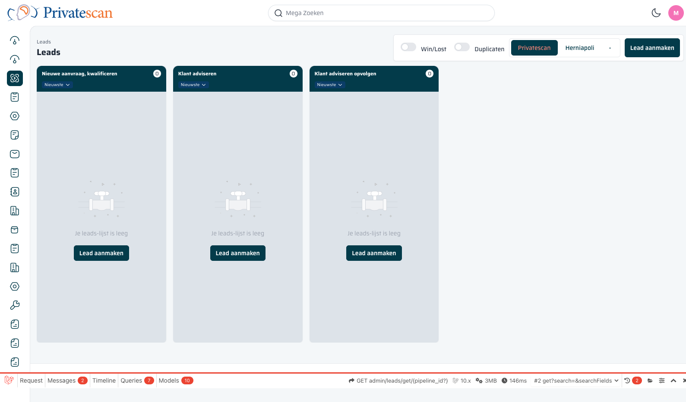

== Overzicht

=== Wat is een lead?

Een *lead* is een potentiële patiënt die interesse heeft getoond in een scan of behandeling bij Privatescan of Herniapoli.
Zodra iemand contact opneemt — via telefoon, website of e-mail — wordt er een lead aangemaakt.
De lead doorloopt vervolgens een aantal fasen in de pipeline totdat de aanvraag is omgezet in een boeking, gewonnen of verloren.

=== Navigeren naar Leads

De Leads-module is bereikbaar via het *zijbalkmenu* aan de linkerkant van het scherm.
Klik op het leads-icoon (derde pictogram van boven) om naar het overzicht te navigeren.

=== Paginaopbouw

Het leads-scherm bestaat uit de volgende onderdelen:

[cols="1,3", options="header"]
|===
| Element | Beschrijving

| *Paginatitel*
| Bovenin staat "Leads" als paginanaam, met daarboven de kruimelpad-navigatie.

| *Win/Lost toggle*
| Schakelaar waarmee afgeronde leads (gewonnen of verloren) zichtbaar of verborgen worden.
Standaard uitgeschakeld, zodat alleen actieve leads getoond worden.

| *Duplicaten toggle*
| Schakelaar om mogelijke dubbele leads te tonen. Handig bij het opschonen van de database.

| *Pipeline-tabs*
| Bovenin staan tabs voor de beschikbare pipelines: *Privatescan*, *Herniapoli* en *-*.
Klik op een tab om de leads van die pipeline te bekijken.
De actieve tab is gemarkeerd met een donkere achtergrond.

| *Lead aanmaken*
| Knop rechtsboven om een nieuwe lead aan te maken. Zie <<lead-aanmaken,Hoofdstuk 3>>.

| *Kanbanbord*
| Het hoofdgedeelte van de pagina toont de leads als kolommenstructuur (kanban).
Elke kolom staat voor een fase in de pipeline.
|===

NOTE: De geselecteerde pipeline-tab bepaalt welke kolommen (fasen) zichtbaar zijn.
Wisselen van tab laadt de bijbehorende pipeline-fasen.
