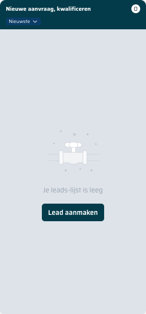

== Kanban leads

Het kanbanbord biedt een visueel overzicht van alle leads, ingedeeld per fase.
Elke kolom vertegenwoordigt een stap in het verkoopproces.

image::../images/leads-kanban-overview.png[Volledig kanbanbord met pipeline-fasen]

=== Kolommen (pipeline-fasen)

De Privatescan-pipeline bevat standaard drie fasen:

[cols="1,3", options="header"]
|===
| Fase | Beschrijving

| *Nieuwe aanvraag, kwalificeren*
| Leads die net zijn binnengekomen en nog gekwalificeerd moeten worden.
Hier wordt bepaald of de aanvraag geschikt is voor een scan of behandeling.

| *Klant adviseren*
| De lead is gekwalificeerd. De medewerker adviseert de klant over de mogelijkheden.

| *Klant adviseren opvolgen*
| Opvolgfase: de klant heeft advies ontvangen maar heeft nog geen beslissing genomen.
|===

=== Kolomheader

Elke kolomheader toont:

[cols="1,3", options="header"]
|===
| Element | Beschrijving

| *Fasenaam*
| De naam van de pipeline-fase staat linksboven in de header.

| *Teller* (getal in cirkel)
| Geeft het aantal leads in deze fase weer.

| *Sorteerdropdown*
| Met de knop "Nieuwste" kan de sortering van de leads in de kolom worden gewijzigd.
Klik op de dropdown om te kiezen tussen sorteervolgorden.
|===

=== Leadkaartjes

Elke lead verschijnt als een kaartje in de betreffende kolomfase.
Een leadkaartje toont de naam van de lead, eventuele gekoppelde activiteiten en e-mails.

TIP: Wanneer er (nog) geen leads zijn, toont de kolom het bericht "Je leads-lijst is leeg"
met een knop om direct een nieuwe lead aan te maken in die fase.

=== Fase wijzigen via drag & drop

Een lead kan van fase worden gewijzigd door het kaartje met de muis te *slepen* van de ene kolom naar de andere.
De lead wordt dan automatisch opgeslagen in de nieuwe fase.

=== Herniapoli-pipeline

Klik op de tab *Herniapoli* bovenin om over te schakelen naar de Herniapoli-pipeline.
Deze pipeline heeft eigen fasen die specifiek zijn voor Herniapoli-aanvragen.

=== Leads filteren

Met de toggles bovenin het scherm kunt u het overzicht aanpassen:

* *Win/Lost* — toon ook afgeronde leads (gewonnen of verloren)
* *Duplicaten* — toon leads die mogelijk dubbel zijn aangemaakt
