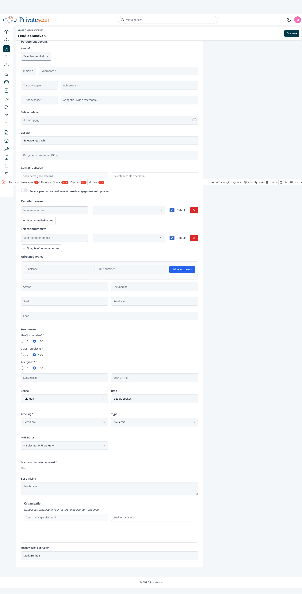
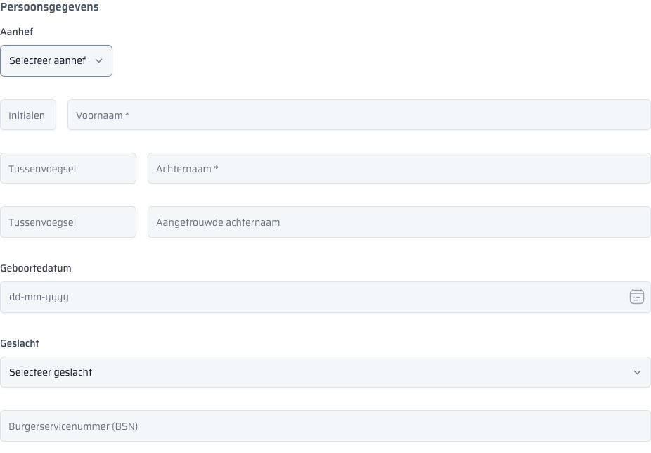
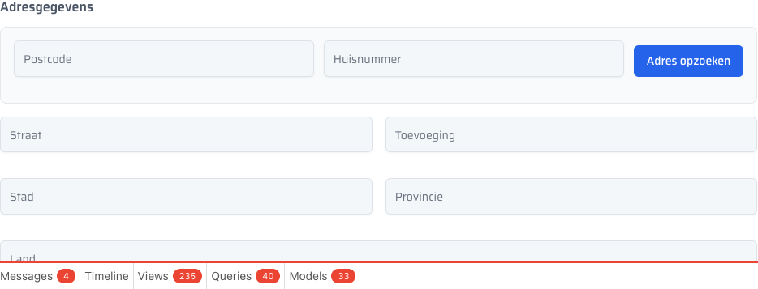
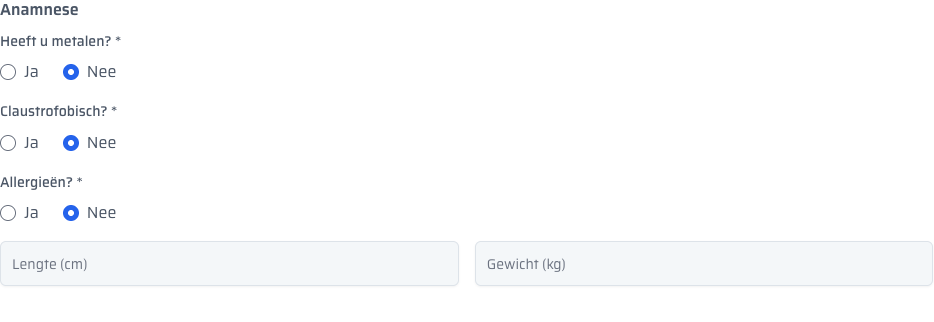
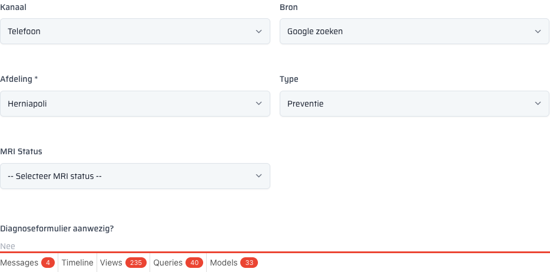

[[lead-aanmaken]]
== Lead aanmaken

Een nieuwe lead wordt aangemaakt via de knop *Lead aanmaken* rechtsboven in het kanbanbord,
of via de knop "Lead aanmaken" onderin een lege kolomfase.
De URL is: `/admin/leads/create`

Het formulier is opgedeeld in de volgende secties:

=== Persoonsgegevens

[cols="2,1,1,3", options="header"]
|===
| Veld | Type | Verplicht | Toelichting

| Aanhef
| Dropdown
| Nee
| Keuze: Dhr. / Mevr.

| Initialen
| Tekst
| Nee
| Bijv. "J.A."

| Voornaam
| Tekst
| *Ja*
| De roepnaam van de patiënt.

| Tussenvoegsel
| Tekst
| Nee
| Bijv. "van", "de", "den".

| Achternaam
| Tekst
| *Ja*
| De achternaam van de patiënt.

| Tussenvoegsel (aangetrouwd)
| Tekst
| Nee
| Tussenvoegsel behorende bij de aangetrouwde achternaam.

| Aangetrouwde achternaam
| Tekst
| Nee
| Wordt gebruikt bij gehuwde patiënten die de meisjesnaam willen vermelden.

| Geboortedatum
| Datum
| Nee
| Formaat: dd-mm-jjjj.

| Geslacht
| Dropdown
| Nee
| Keuze: Man / Vrouw / Anders.

| Burgerservicenummer (BSN)
| Tekst
| Nee
| Het BSN van de patiënt. Het veld heeft autocomplete uitgeschakeld voor privacybescherming.
|===

=== Contactpersoon

Koppel een bestaande persoon uit het CRM als contactpersoon voor deze lead.
Gebruik het zoekveld "Selecteer contactpersoon..." om te zoeken op naam.

Activeer de optie *Tevens persoon aanmaken met deze lead gegevens en koppelen* om automatisch
een nieuw persoonsprofiel aan te maken op basis van de ingevulde persoonsgegevens.

NOTE: De contactpersoon wordt gekoppeld aan de lead en kan ook voorkomen in de gekoppelde personen.

=== E-mailadressen

Voeg een of meerdere e-mailadressen toe voor de lead.

[cols="2,1,1,3", options="header"]
|===
| Veld | Type | Verplicht | Toelichting

| E-mailadres
| E-mail
| Nee
| Voer het e-mailadres in.

| Label
| Dropdown
| Nee
| Keuze: Eigen / Relatie / Anders.

| Default
| Vinkje
| Nee
| Markeer het primaire e-mailadres als default.
|===

Klik op *+ Voeg e-mailadres toe* om extra e-mailadressen toe te voegen.
Verwijder een e-mailadres met de rode ×-knop.

=== Telefoonnummers

Voeg een of meerdere telefoonnummers toe voor de lead.

[cols="2,1,1,3", options="header"]
|===
| Veld | Type | Verplicht | Toelichting

| Telefoonnummer
| Tekst
| Nee
| Voer het telefoonnummer in.

| Label
| Dropdown
| Nee
| Keuze: Eigen / Relatie / Anders.

| Default
| Vinkje
| Nee
| Markeer het primaire telefoonnummer als default.
|===

Klik op *+ Voeg telefoonnummer toe* om extra nummers toe te voegen.

=== Adresgegevens

[cols="2,1,1,3", options="header"]
|===
| Veld | Type | Verplicht | Toelichting

| Postcode
| Tekst
| Nee
| Bijv. "1234 AB".

| Huisnummer
| Tekst
| Nee
| Bijv. "10" of "10a".

| Adres opzoeken
| Knop
| —
| Vult automatisch Straat en Stad in op basis van postcode + huisnummer.

| Straat
| Tekst
| Nee
| Wordt automatisch ingevuld na opzoeken.

| Toevoeging
| Tekst
| Nee
| Bijv. "A", "1e verdieping".

| Stad
| Tekst
| Nee
| Wordt automatisch ingevuld na opzoeken.

| Provincie
| Tekst
| Nee
| Bijv. "Noord-Holland".

| Land
| Tekst
| Nee
| Standaard: "Nederland".
|===

TIP: Vul eerst de postcode en het huisnummer in en klik daarna op *Adres opzoeken*.
Het systeem zoekt het adres op via een externe postcode-API en vult de overige velden automatisch in.

=== Anamnese

De anamnesevragen zijn medisch relevant voor de MRI-scan procedure.

[cols="2,1,1,3", options="header"]
|===
| Veld | Type | Verplicht | Toelichting

| Heeft u metalen?
| Ja/Nee
| *Ja*
| Metalen implantaten of prothesen kunnen gevaarlijk zijn bij MRI.
Standaard: Nee.

| Claustrofobisch?
| Ja/Nee
| *Ja*
| Relevant voor het type MRI-scanner (open vs. gesloten).
Standaard: Nee.

| Allergieën?
| Ja/Nee
| *Ja*
| Voor eventueel gebruik van contrastmiddelen.
Standaard: Nee.

| Lengte (cm)
| Getal
| Nee
| Lengte van de patiënt in centimeters.

| Gewicht (kg)
| Getal
| Nee
| Gewicht van de patiënt in kilogram.
|===

WARNING: De drie ja/nee-vragen zijn verplicht. Antwoord "Ja" vereist mogelijk extra actie
bij het inplannen van de scan.

=== Classificatie

[cols="2,1,1,3", options="header"]
|===
| Veld | Type | Verplicht | Toelichting

| Kanaal
| Dropdown
| Nee
| Via welk kanaal is de lead binnengekomen? Keuze: Telefoon, Website, E-mail, Tel-en-Tel, Agenten, Partners, Social media, Webshop, Campagne.

| Bron
| Dropdown
| Nee
| Via welke bron heeft de patiënt ons gevonden? Bijv. "Google zoeken", "bodyscan.nl", "Bestaande klant".

| Afdeling
| Dropdown
| *Ja*
| Naar welke afdeling behoort de lead: *Herniapoli* of *Privatescan*.

| Type
| Dropdown
| Nee
| Aard van de aanvraag: Preventie, Gericht, Operatie, Overig.

| MRI Status
| Dropdown
| Nee
| Huidige status van de MRI-scan. Keuze: Geen MRI-scan, Heeft recente MRI, Wenst MRI via ons, Krijgt een MRI via ons, Stuurt extern gemaakte MRI op, MRI beelden zijn binnen.

| Diagnoseformulier aanwezig?
| Informatief
| —
| Toont of er al een diagnoseformulier aanwezig is (alleen-lezen).
|===

=== Beschrijving

Vrij tekstveld voor aanvullende opmerkingen over de lead of de aanvraag.

=== Organisatie

Koppel optioneel een organisatie voor facturatiedoeleinden.
Gebruik het zoekveld "Zoek organisatie..." om een bestaande organisatie te koppelen,
of klik op *Nieuwe organisatie toevoegen* om een nieuwe organisatie aan te maken.

=== Toegewezen gebruiker

Wijs de lead toe aan een CRM-gebruiker.
Standaard wordt de ingelogde gebruiker geselecteerd.

=== Opslaan

Klik op de knop *Opslaan* rechtsboven in de paginakop om de lead op te slaan.
Na opslaan wordt u doorgeleid naar de detailpagina van de nieuw aangemaakte lead.
