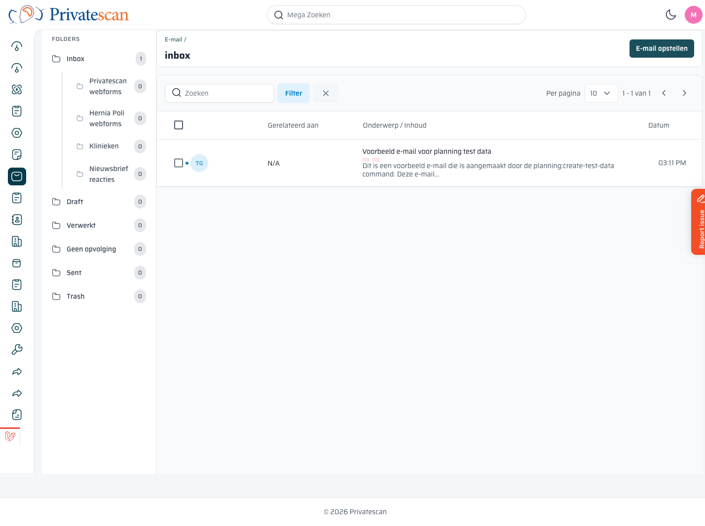
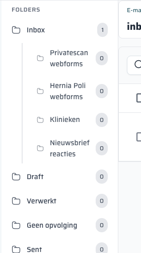

== Overzicht van de E-mailmodule

=== Navigeren naar E-mail

Klik in het zijbalkmenu op het *envelop-icoon* (zevende pictogram van boven) om naar de e-mailmodule te gaan.

De pagina bestaat uit twee delen:

* *Linkerpaneel* — mappenstructuur (Folders)
* *Rechterpaneel* — de e-mails in de geselecteerde map

=== Mappenstructuur

[cols="1,3", options="header"]
|===
| Map | Inhoud

| *Inbox*
| Alle inkomende e-mails die nog niet zijn ingedeeld. Het getal toont het aantal ongelezen e-mails.

| *↳ Privatescan webforms*
| E-mails die binnenkomen via het contactformulier op de Privatescan website. Worden automatisch hier geplaatst.

| *↳ Hernia Poli webforms*
| E-mails via het contactformulier van de Herniapoli website.

| *↳ Klinieken*
| E-mails afkomstig van klinieken (o.a. bevestigingen, rapporten, vragen).

| *↳ Nieuwsbrief reacties*
| Reacties op verzonden nieuwsbrieven.

| *Draft*
| Conceptberichten die nog niet zijn verzonden.

| *Verwerkt*
| E-mails die je handmatig naar 'Verwerkt' hebt verplaatst — ze zijn afgehandeld en hoeven geen verdere actie.

| *Geen opvolging*
| E-mails die je niet hoeft op te volgen (bijv. spam, automatische meldingen, irrelevante berichten).

| *Sent*
| E-mails die je hebt verzonden vanuit het CRM.

| *Trash*
| Verwijderde e-mails.
|===

TIP: Klik op een map om de inhoud te zien. De actieve map wordt blauw gemarkeerd.

=== Tabelkolommen in de inbox

[cols="1,3", options="header"]
|===
| Kolom | Uitleg

| *(vinkje)*
| Selectievakje om meerdere e-mails tegelijk te selecteren.

| *(avatar)*
| Initialen van de afzender met kleurcode.

| *Gerelateerd aan*
| De lead, sales of order waaraan deze e-mail is gekoppeld. Staat op _N/A_ als nog niet gekoppeld.

| *Onderwerp / Inhoud*
| Het onderwerp en een preview van de tekst. Ongelezen e-mails worden vetgedrukt weergegeven.

| *Datum*
| Tijdstip van ontvangst.
|===
