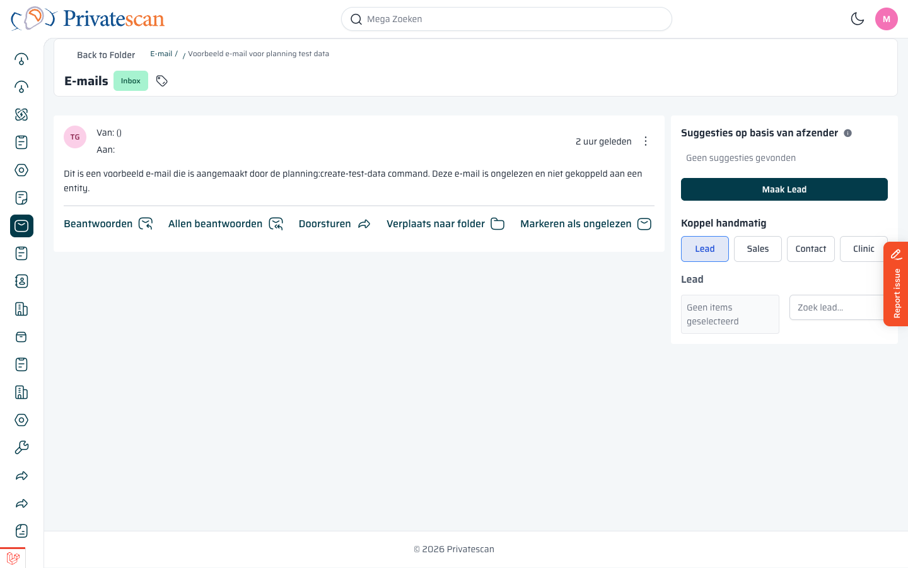
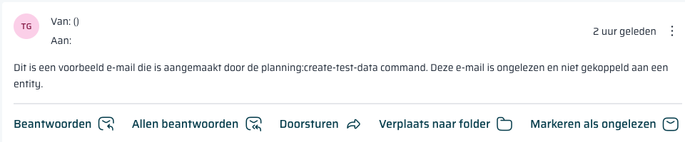
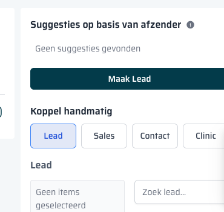
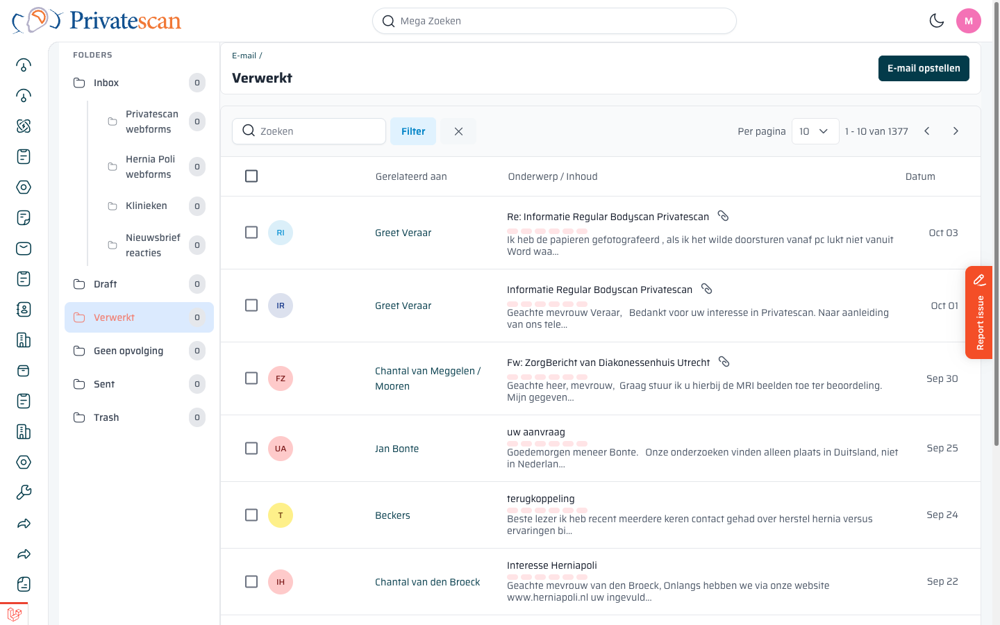
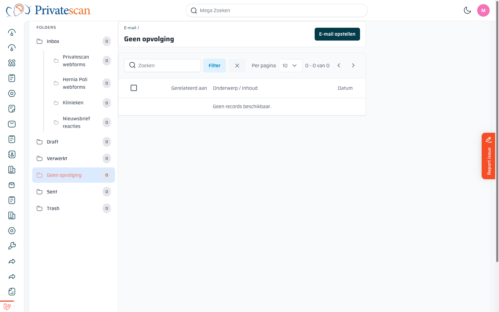

== Een e-mail lezen en afhandelen

=== E-mail openen

Klik op een regel in de inbox om de e-mail te openen.

Je ziet bovenin *Back to Folder* om terug te gaan naar de mappenlijst, en een badge die de huidige map aangeeft (bijv. _Inbox_).

=== Actiebalk

Onder de e-mailtekst staan de volgende knoppen:

[cols="1,3", options="header"]
|===
| Actie | Wat doet het?

| *Beantwoorden*
| Stuur een antwoord terug naar de afzender.

| *Allen beantwoorden*
| Antwoord aan alle ontvangers in de oorspronkelijke e-mail (inclusief CC).

| *Doorsturen*
| Stuur de e-mail door naar een andere ontvanger.

| *Verplaats naar folder*
| Verplaats de e-mail naar een andere map (bijv. _Verwerkt_ of _Geen opvolging_).

| *Markeren als ongelezen*
| Zet de e-mail terug op ongelezen zodat je hem later niet vergeet.
|===

=== E-mail koppelen aan een lead of order

Rechts naast de e-mailtekst zie je het koppelpaneel.
Dit is een van de belangrijkste functies: elke e-mail moet worden gekoppeld aan de juiste lead, sales of order.

==== Suggesties op basis van afzender

Het CRM zoekt automatisch op e-mailadres van de afzender naar een bestaand contact.
Als er een match is, verschijnt hier een suggestie.
Klik op de naam om de koppeling te bevestigen.

==== Handmatig koppelen

Is er geen automatische suggestie, of wil je aan iets anders koppelen?
Gebruik de tabs *Lead*, *Sales*, *Contact* of *Clinic*:

[cols="1,3", options="header"]
|===
| Tab | Koppelen aan

| *Lead*
| Een bestaande lead (patiëntaanvraag in het leadproces).

| *Sales*
| Een sales lead (actief verkooptraject).

| *Contact*
| Een persoon of organisatie in het CRM.

| *Clinic*
| Een kliniek.
|===

Typ in het zoekveld om snel de juiste record te vinden en klik dan op de naam.
De e-mail is nu gekoppeld en zichtbaar in de tijdlijn van die lead/order.

==== Maak Lead vanuit e-mail

Staat er nog geen lead voor deze afzender?
Klik op de knop *Maak Lead* om direct een nieuwe lead aan te maken op basis van deze e-mail.
De e-mail wordt automatisch aan die nieuwe lead gekoppeld.

=== E-mail verplaatsen naar Verwerkt

Als je klaar bent met een e-mail:

. Klik op *Verplaats naar folder* onder de e-mailtekst.
. Kies *Verwerkt*.

De e-mail verdwijnt uit de inbox en staat in de map _Verwerkt_.
Zo hou je de inbox overzichtelijk met alleen de e-mails die nog actie vereisen.

=== E-mail naar "Geen opvolging"

Hoeft een e-mail geen actie? (bijv. automatische bevestiging, spam, niet-relevante mail)

. Klik op *Verplaats naar folder*.
. Kies *Geen opvolging*.

Zo verdwijnt de e-mail uit de inbox zonder dat je hem verwijdert.
