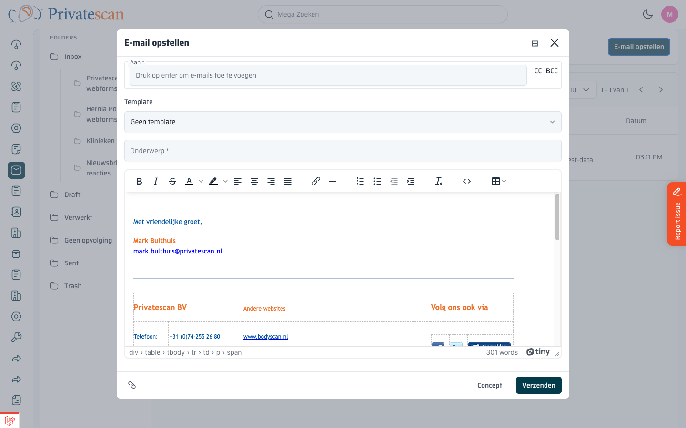

== E-mail opstellen en verzenden

=== Nieuw bericht opstellen

Klik op de knop *E-mail opstellen* rechtsboven in de inbox.
Er opent een venster over de pagina.

=== Velden invullen

[cols="1,3", options="header"]
|===
| Veld | Uitleg

| *Aan*
| Het e-mailadres van de ontvanger. Typ een adres en druk op Enter om het toe te voegen.
Voeg meerdere ontvangers toe door steeds Enter te drukken.

| *CC / BCC*
| Klik op de knop *CC* of *BCC* rechts van het Aan-veld om extra ontvangers toe te voegen.
CC = zichtbare kopie, BCC = onzichtbare kopie.

| *Template*
| Kies een vooraf ingestelde e-mailtemplate (bijv. orderbevestiging, afspraakherinnering).
Kies _Geen template_ voor een vrij bericht.

| *Onderwerp*
| Het onderwerp van de e-mail.

| *Berichttekst*
| Typ hier je bericht. De handtekening staat al automatisch ingevuld.
Gebruik de opmaakbalk voor vetgedrukt, cursief, lijsten, koppelingen, etc.
|===

=== Opmaakbalk

De rijke tekstbewerker heeft knoppen voor:

* *Vet, cursief, doorhalen* — tekstopmaak
* *Tekstkleur en markeerkleur*
* *Links, gecentreerd, rechts uitlijnen*
* *Genummerde en ongenummerde lijsten*
* *Hyperlink invoegen*
* *Tabel invoegen*

=== Versturen of opslaan als concept

[cols="1,3", options="header"]
|===
| Knop | Actie

| *Verzenden*
| Stuurt de e-mail direct naar de ontvanger. De e-mail verschijnt daarna in de map _Sent_.

| *Concept*
| Slaat de e-mail op als concept zonder te verzenden. Terug te vinden in de map _Draft_.
|===

=== Beantwoorden en doorsturen

Klik in de e-maildetailpagina op *Beantwoorden* of *Doorsturen*.
Er opent hetzelfde opstelvenster, maar met het Aan-veld en het onderwerp al ingevuld.
De originele e-mailtekst staat als citaat in het bericht.

NOTE: De handtekening wordt automatisch toegevoegd aan elk nieuw bericht en elke reply, zolang die niet al aanwezig is in de tekst.
