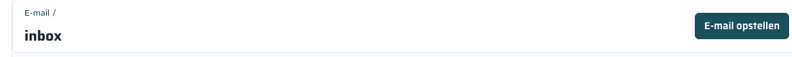

== Werkwijze

=== Dagelijkse routine

Doorloop de inbox elke dag in deze volgorde:

. Open de *Inbox* en bekijk nieuwe berichten.
. Koppel elke e-mail aan de juiste lead, sales, order of contact (rechterpaneel).
. Beantwoord e-mails die een reactie vereisen.
. Verplaats afgehandelde e-mails naar *Verwerkt*.
. Verplaats irrelevante e-mails naar *Geen opvolging*.
. Controleer de submap *Klinieken* voor rapporten of bevestigingen van klinieken.

TIP: Een lege inbox is het doel. Elke e-mail in de inbox die niet meer 'Verwerkt' of 'Geen opvolging' hoort, heeft aandacht nodig.

=== Webform e-mails

Nieuwe aanvragen via de website komen automatisch binnen in:

* *Privatescan webforms* — voor Privatescan-aanvragen
* *Hernia Poli webforms* — voor Herniapoli-aanvragen

Werkwijze voor webform e-mails:

. Open de submap.
. Lees de aanvraag.
. Klik *Maak Lead* om direct een lead aan te maken — de e-mail wordt automatisch gekoppeld.
. Verplaats de e-mail naar *Verwerkt*.

WARNING: Webform e-mails niet ongelezen laten staan. Nieuwe patiëntvragen moeten dezelfde dag worden opgepakt.

=== Zoeken en filteren

Boven de e-maillijst vind je een *zoekveld* en een *Filterknop*.

* Typ in het zoekveld om te zoeken op onderwerp of afzender.
* Klik *Filter* voor extra filteropties zoals ongelezen, ongekoppeld of datum.
* Klik het *×* om alle filters te wissen.

De standaard inbox-weergave toont automatisch *ongelezen en ongekoppelde* e-mails — zodat je direct ziet wat er nog aandacht nodig heeft.

=== E-mails selecteren en bulkacties

Zet een vinkje voor één of meerdere e-mails om ze tegelijk te verplaatsen of te verwijderen.
Zo kun je snel meerdere e-mails in één keer verwerken.

=== Bladeren door pagina's

Rechts boven de lijst staan paginaknoppen.
Standaard worden 10 e-mails per pagina getoond.
Pas dit aan met het _Per pagina_-menu als je meer wilt zien.
