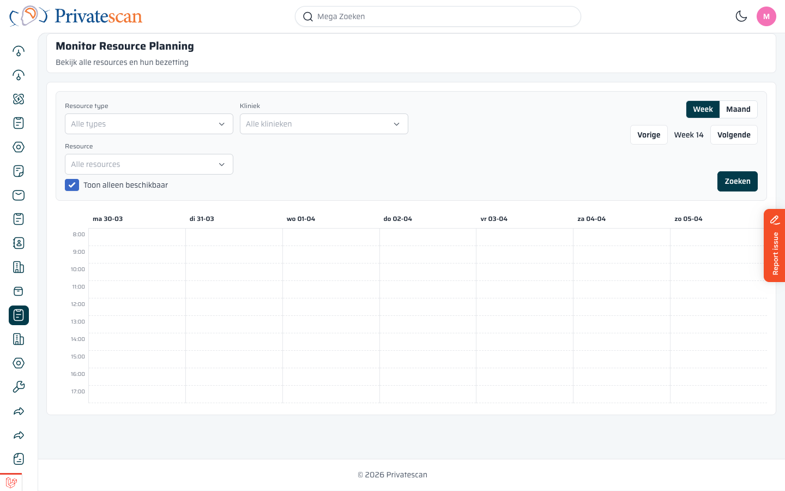
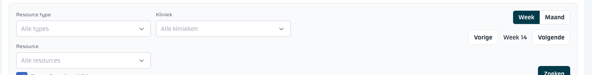
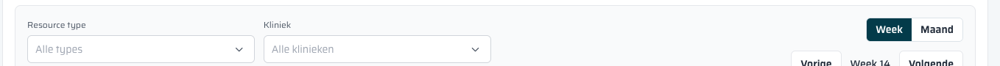
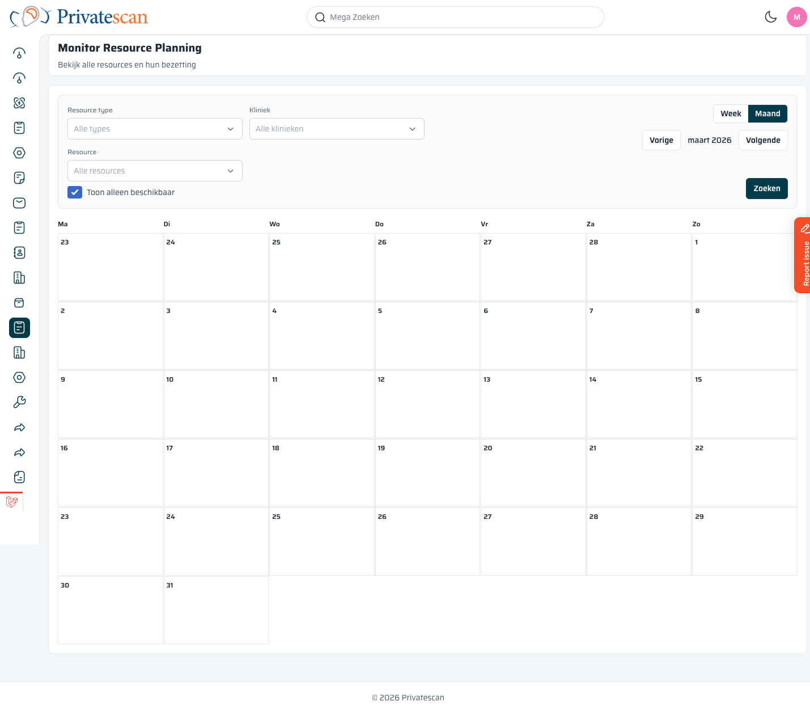

== De Monitor: bezetting bekijken

=== Paginaopbouw

Het scherm bestaat uit twee delen:

* *Filterbalk* bovenin — bepaal welke resources je wilt zien
* *Kalender* eronder — toont de beschikbaarheid per dag en uur

=== Filterbalk

[cols="1,3", options="header"]
|===
| Filter | Uitleg

| *Resource type*
| Filter op type scanner of resource (bijv. alleen MRI-scanners).
Kies _Alle types_ om alles te zien.

| *Kliniek*
| Filter op een specifieke kliniek.
Handig als je alleen de planning van één locatie wilt bekijken.

| *Resource*
| Filter op een specifiek apparaat of persoon binnen de geselecteerde kliniek en het type.

| *Toon alleen beschikbaar*
| Aangevinkt: het rooster toont alleen vrije tijdsloten — bezette tijden worden verborgen.
Uitgevinkt: je ziet zowel vrije als bezette tijden in het rooster.

| *Zoeken*
| Klik op *Zoeken* om de kalender te vernieuwen met de ingestelde filters.
|===

=== Week- en maandweergave

Rechtsboven in de filterbalk staan twee knoppen:

* *Week* — toont 7 dagen naast elkaar met uurtijden (8:00–17:00)
* *Maand* — toont de volledige maand in een maandkalender

Navigeer met *Vorige* en *Volgende* om te bladeren.
Het middelste label toont de huidige periode (bijv. _Week 14_ of _April 2026_).

=== De kalender lezen

In de weekweergave staan de dagen als kolommen en de uren als rijen (8:00–17:00).

Elke resource verschijnt als een *rij* in het rooster:

[cols="1,3", options="header"]
|===
| Blok kleur | Betekenis

| *Groen / blauw*
| Vrij tijdslot — de resource is beschikbaar en kan ingepland worden.

| *Rood / grijs*
| Bezet tijdslot — de resource is al geboekt voor een andere order.

| *Leeg (wit)*
| Buiten de dienst — de resource is in die periode niet ingeroosterd.
|===

TIP: Is een resource niet zichtbaar? Controleer of de filterbalk breed genoeg is ingesteld (resource type, kliniek, resource). Klik daarna op *Zoeken*.

=== Toon alleen beschikbaar

Zet het vinkje *Toon alleen beschikbaar* aan om bezette tijden te verbergen.
Je ziet dan uitsluitend de vrije tijdsloten — handig als je snel wilt zien wanneer er nog ruimte is.

Zet het vinkje uit als je ook de bestaande boekingen wilt zien naast de vrije tijden.
