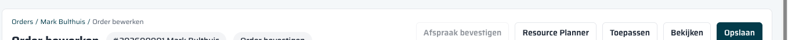
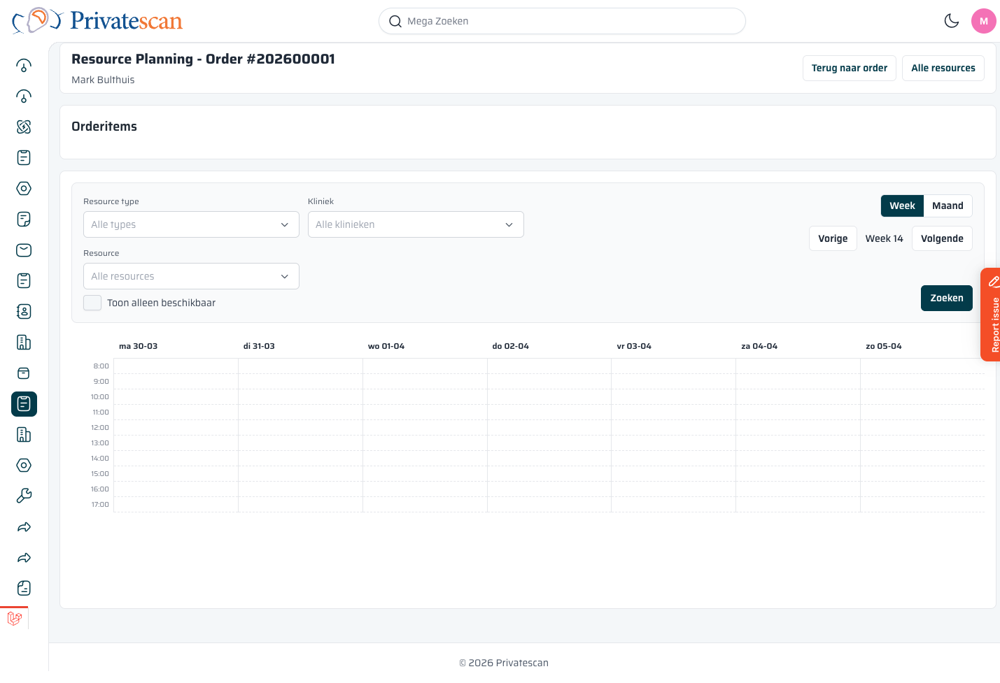

== Een order inplannen

=== Stap 1: Open de Resource Planner vanuit de order

Ga naar de bewerkpagina van de order (*Orders → klik op order → Bewerk order*).
Klik bovenin op de knop *Resource Planner*.

Je gaat nu naar de Resource Planner die speciaal is ingesteld voor deze order.

=== Stap 2: De order-planner

De order-planner toont bovenin:

* De *ordertitel* en het *ordernummer* (bijv. _Resource Planning - Order #202600001 / Mark Bulthuis_)
* Een knop *Terug naar order* — om terug te gaan zonder te plannen
* Een knop *Alle resources* — om naar de algemene monitor te gaan

Daaronder staat het blok *Orderitems* met de te plannen onderzoeken.
Elk orderitem heeft een bijbehorend *resource type* dat bepaalt welk soort apparaat of specialist nodig is.

=== Stap 3: Selecteer het orderitem dat je wilt inplannen

Klik op het orderitem (het onderzoek) dat je wilt inplannen.
De kalender past zich aan: hij toont nu alleen resources van het juiste type.

Voorbeeld: voor een MRI-scan zie je alleen MRI-scanners in het rooster.

=== Stap 4: Stel de filters in

Gebruik de filterbalk om de weergave te verfijnen:

* Kies een *Kliniek* als je al weet bij welke locatie de scan plaatsvindt.
* Zet *Toon alleen beschikbaar* aan om vrije tijdsloten snel te zien.
* Klik op *Zoeken* om het rooster bij te werken.

=== Stap 5: Klik op een vrij tijdslot

Klik in het rooster op een groen/blauw blok (vrij tijdslot) bij de gewenste resource en datum/tijd.
Er opent een boekingsvenster.

=== Stap 6: Bevestig de boeking

In het boekingsvenster vul je in (of controleer je):

[cols="1,3", options="header"]
|===
| Veld | Uitleg

| *Orderitem*
| Het onderzoek dat je inplant (al geselecteerd).

| *Resource*
| De scanner of resource die je boekt.

| *Van*
| Starttijd van de boeking.

| *Tot*
| Eindtijd van de boeking. Wordt automatisch berekend op basis van de duur van het product.

| *Bestaande boeking vervangen*
| Als dit orderitem al eerder was ingepland: zet dit aan om de oude boeking te overschrijven.
|===

Klik op *Bevestigen* om de boeking op te slaan.

=== Resultaat na inplannen

Na een succesvolle boeking:

* Het tijdslot in de kalender wordt *rood/grijs* — het is nu bezet.
* Het orderitem krijgt de status *Ingepland* in de order.
* In de order is zichtbaar op welke datum en bij welke resource het onderzoek staat.

NOTE: Het systeem valideert automatisch of het gekozen tijdslot binnen de dienst van de resource valt. Valt het erbuiten, dan geeft het systeem een foutmelding. Kies een ander tijdslot of neem contact op met de planner.

=== Boeking wijzigen

Wil je een boeking verplaatsen?

. Open de order-planner opnieuw via *Resource Planner* op de order.
. Selecteer het orderitem.
. Klik op een nieuw tijdslot.
. Zet *Bestaande boeking vervangen* aan.
. Bevestig.

De oude boeking wordt verwijderd en de nieuwe boeking aangemaakt.

=== Boeking verwijderen (item als verloren markeren)

Een boeking wordt automatisch verwijderd als het orderitem de status *Verloren* krijgt.
De planningstijd komt dan weer vrij voor andere orders.
