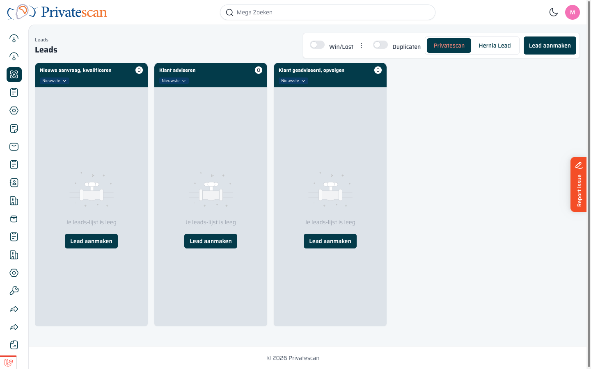

== Navigeren naar Sales

Het Sales-gedeelte is bereikbaar via het *zijbalkmenu* aan de linkerkant van het scherm.
Er zijn twee onderdelen:

[cols="1,3", options="header"]
|===
| Onderdeel | Wat doet het?

| *Sales*
| Kanbanbord met sales-kansen (per fase van het verkoopproces).

| *Orders*
| Kanbanbord met lopende orders van patiënten. Hier wordt het scanproces bijgehouden.
|===

Klik op het gewenste pictogram in de linkerbalk om te navigeren.
Het actieve menu-item krijgt een gekleurde achtergrond.

TIP: Weet je niet zeker waar je bent? Kijk naar de *kruimelpad-navigatie* bovenin de pagina (bijv. _Orders / Mark Bulthuis / 202600001_). Zo zie je altijd in welk onderdeel je werkt.
