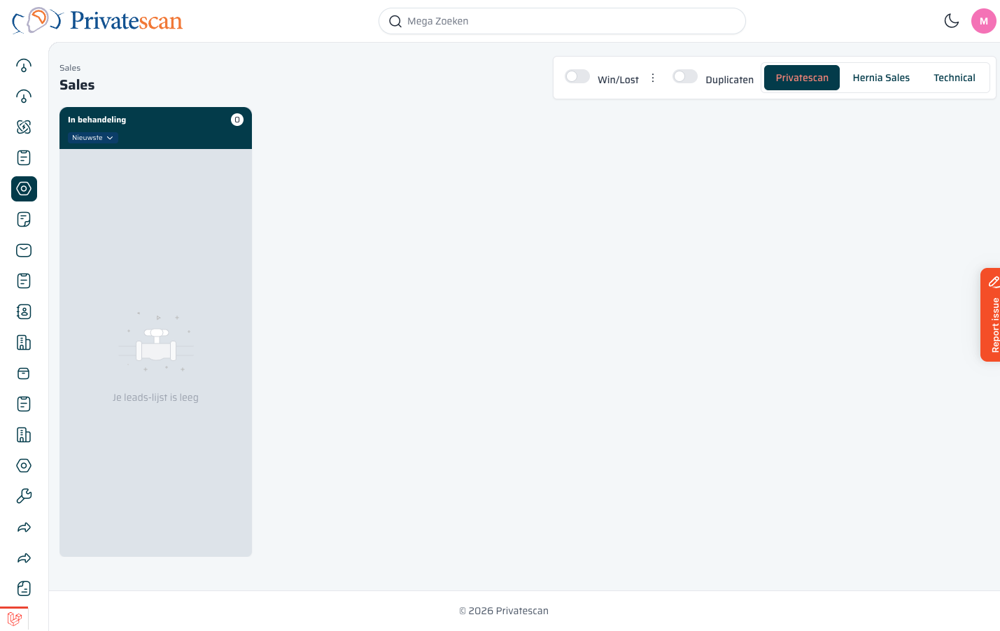

== Sales Leads

=== Wat is een sales lead?

Een *sales lead* is een klant die al voldoende interesse heeft getoond om een offerte of afspraak te plannen.
Sales leads komen voort uit gewone leads en worden beheerd op het Sales-kanbanbord.

=== Overzicht

Het Sales-scherm toont een kanbanbord met kolommen per fase.
Bovenin vind je de volgende bedieningselementen:

[cols="1,3", options="header"]
|===
| Element | Uitleg

| *Win/Lost*
| Zet aan om gewonnen of verloren sales-leads te tonen. Standaard uitgeschakeld.

| *Duplicaten*
| Toont mogelijke dubbele sales-leads.

| *Privatescan / Hernia Sales / Technical*
| Tabs om te wisselen tussen de verschillende verkooppipelines.
|===

=== Kolomfasen

Elke kolom staat voor een fase in het verkoopproces.
Een sales lead schuift van links naar rechts naarmate het traject vordert.

De huidige fase is altijd zichtbaar als badge op de kaart (bijv. _In behandeling_).

NOTE: Zijn er geen kaarten zichtbaar? Controleer welke pipeline-tab actief is. Elke tab toont alleen de leads van die specifieke pipeline.
