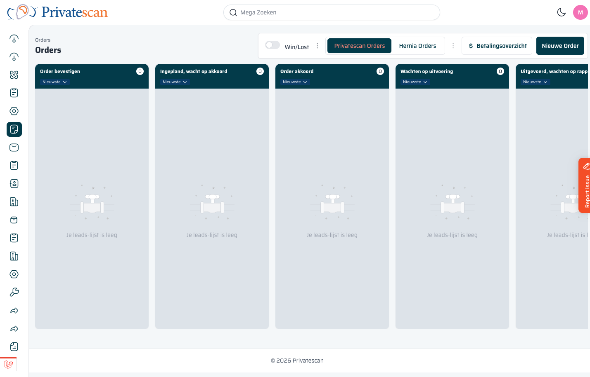

== Orders Overzicht

=== Wat is een order?

Een *order* is een bevestigde afspraak voor één of meerdere scans of onderzoeken.
Een order is gekoppeld aan een sales lead en aan één of meerdere patiënten (personen).

=== Het Orders-kanbanbord

Het Orders-scherm werkt net als het Sales-scherm: kolommen per fase, tabs voor verschillende pipelines.

==== Fasen van een order

Een order doorloopt de volgende stappen:

[cols="1,3", options="header"]
|===
| Fase | Betekenis

| *Order bevestigen*
| De order is aangemaakt maar nog niet bevestigd door de klant.

| *Ingepland, wacht op akkoord*
| Er is een tijdslot ingepland, de klant moet nog akkoord geven.

| *Order akkoord*
| De klant heeft akkoord gegeven. De order is definitief.

| *Wachten op uitvoering*
| De scan staat gepland en wacht op uitvoering op de kliniek.

| *Uitgevoerd, wachten op operatieverslag*
| De scan is uitgevoerd. Het rapport is nog in afwachting.

| *Rapporten vertalen*
| Het rapport wordt vertaald of nagelezen.

| *Gewonnen / Verloren*
| De order is volledig afgerond (gewonnen) of geannuleerd (verloren).
|===

==== Bovenbalkknoppen

[cols="1,3", options="header"]
|===
| Knop | Wat doet het?

| *Privatescan Orders / Hernia Orders*
| Schakel tussen de twee pipelines.

| *$ Betalingsoverzicht*
| Toont een overzicht van alle openstaande betalingen. Zie <<betalingsoverzicht,Hoofdstuk 6>>.

| *Nieuwe Order*
| Maak een nieuwe order aan. Zie <<order-aanmaken,Hoofdstuk 4>>.
|===
