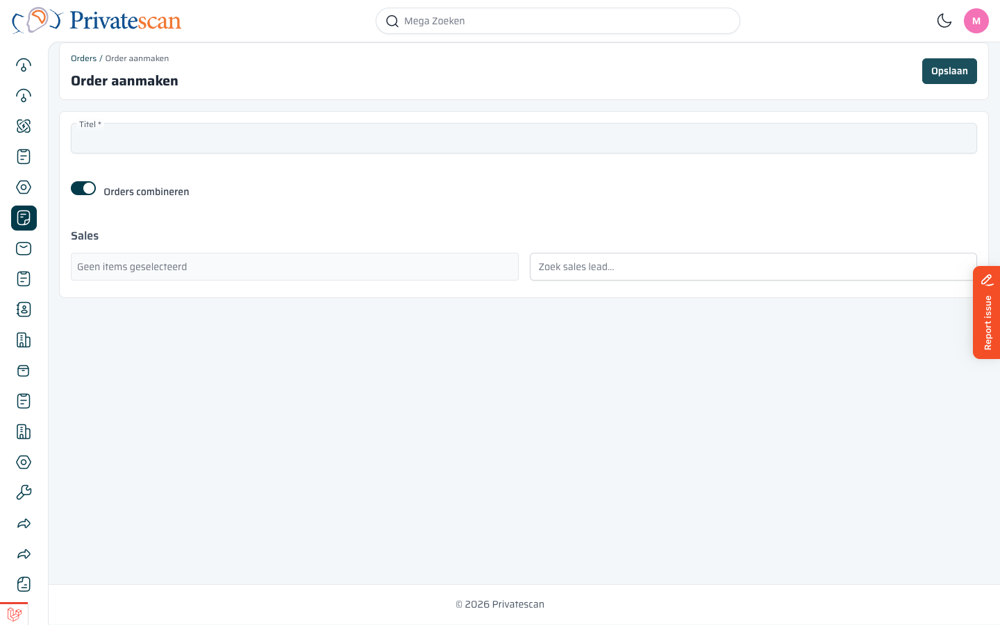
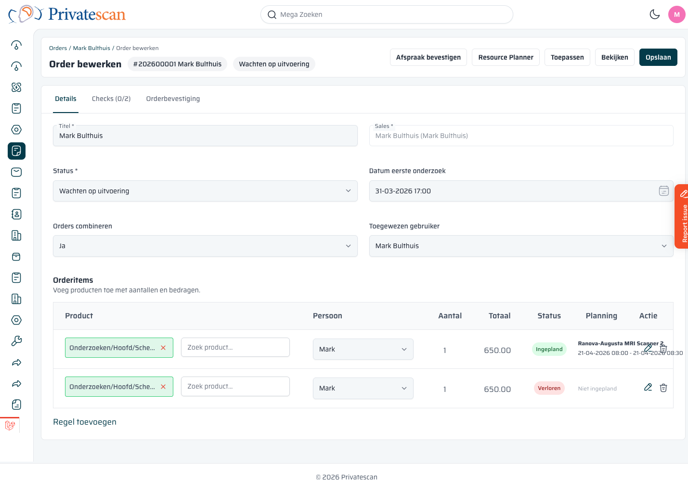

[[order-aanmaken]]
== Order aanmaken

=== Stap 1: Klik op "Nieuwe Order"

Klik rechtsbovenin het Orders-scherm op de knop *Nieuwe Order*.
Je belandt op het aanmaakformulier.

=== Stap 2: Vul het formulier in

[cols="1,3", options="header"]
|===
| Veld | Uitleg

| *Titel*
| De naam van de order, meestal de naam van de patiënt.

| *Orders combineren*
| Staat standaard aan. Meerdere onderzoeken voor dezelfde patiënt worden gecombineerd in één order.

| *Sales lead zoeken*
| Koppel de order aan een bestaande sales lead. Typ de naam om te zoeken.
|===

Klik op *Opslaan* om de order aan te maken.

NOTE: Na het aanmaken kom je automatisch in de bewerkpagina van de order, waar je producten en details kunt toevoegen.

=== Stap 3: Vul de orderdetails in

Na het aanmaken open je de order via het kanbanbord en klik je op *Bewerk order*.

Op de bewerkpagina vul je in:

[cols="1,3", options="header"]
|===
| Veld | Uitleg

| *Titel*
| De naam van de order.

| *Sales*
| De gekoppelde sales lead (automatisch ingevuld als je vanuit sales lead werkt).

| *Status*
| De huidige fase van de order. Pas dit aan als de order een stap verder is.

| *Datum eerste onderzoek*
| Wanneer het eerste onderzoek staat gepland.

| *Orders combineren*
| Ja/Nee — meerdere onderzoeken in één order.

| *Toegewezen gebruiker*
| De medewerker die verantwoordelijk is voor deze order.
|===

==== Orderitems toevoegen

Onder de basisgegevens staan de *Orderitems*.
Hier voeg je de producten (onderzoeken) toe die de patiënt afneemt.

Klik op *Regel toevoegen* om een nieuw onderzoek toe te voegen.

[cols="1,3", options="header"]
|===
| Kolom | Uitleg

| *Product*
| Het onderzoek of de scan (bijv. _MRI Schedel exclusief CM_). Zoek op naam.

| *Persoon*
| De patiënt voor wie dit item geldt.

| *Aantal*
| Standaard 1.

| *Totaal*
| De prijs voor dit item. Wordt automatisch ingevuld vanuit het productcatalogus.

| *Status*
| Wordt automatisch ingesteld (Nieuw, Ingepland, Gewonnen, Verloren).

| *Planning*
| Toont de ingeplande datum en het scanapparaat zodra gepland.
|===

Klik op *Opslaan* als je klaar bent.

TIP: Wil je de order bekijken zonder wijzigingen op te slaan? Klik op *Bekijken* bovenin.
