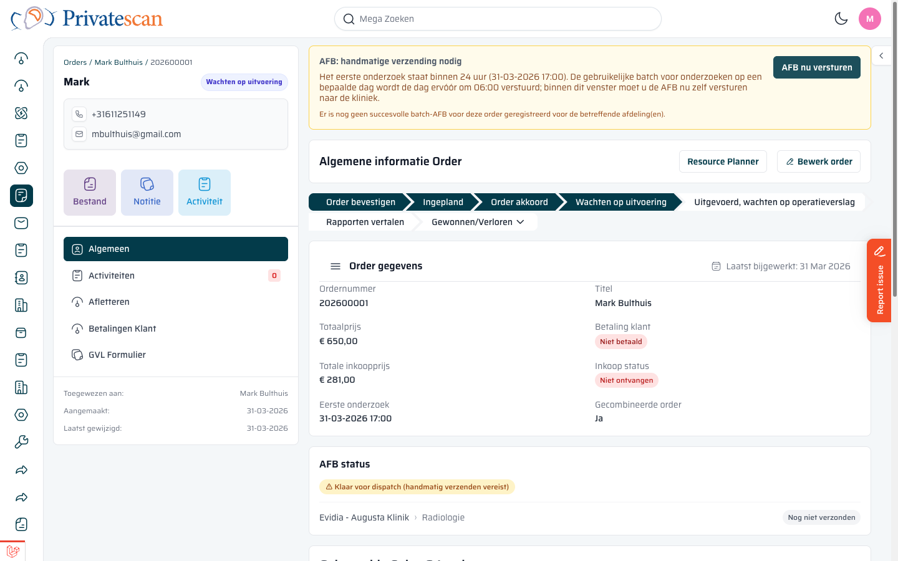
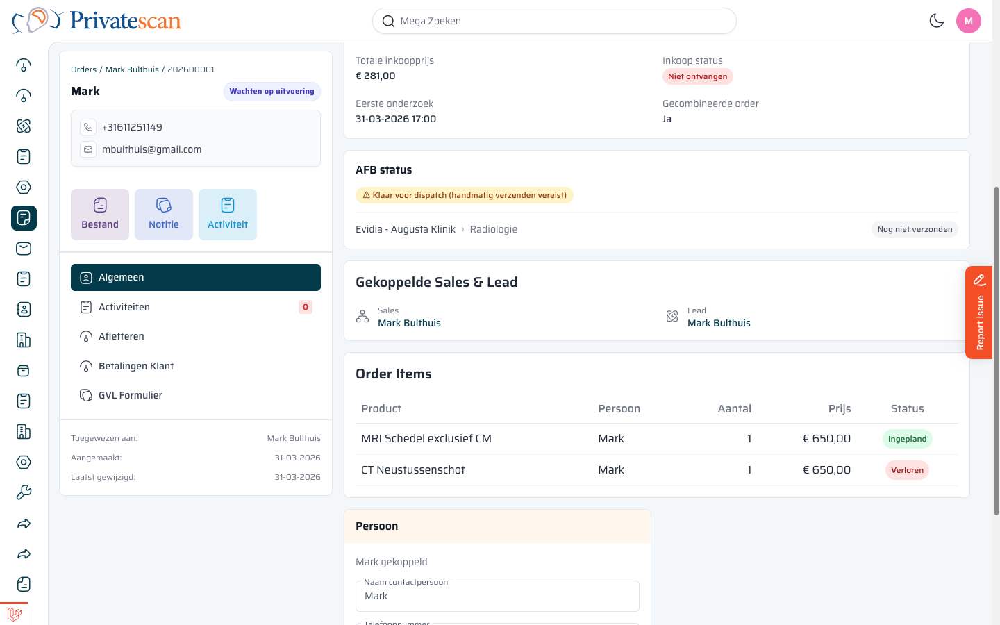
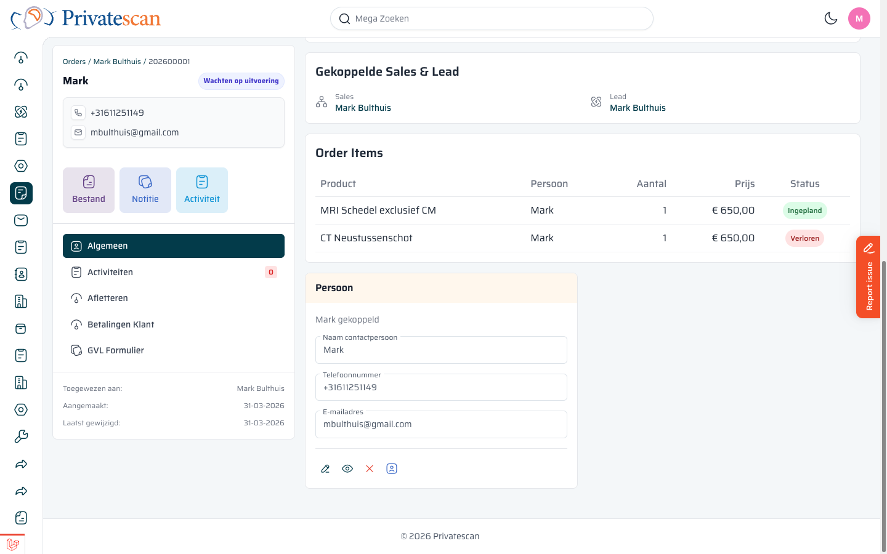
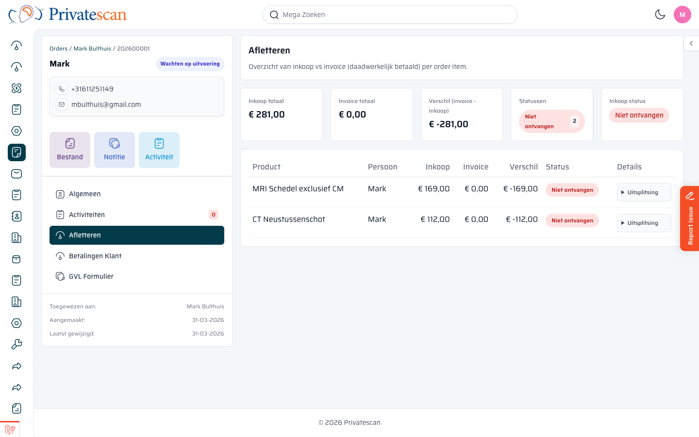
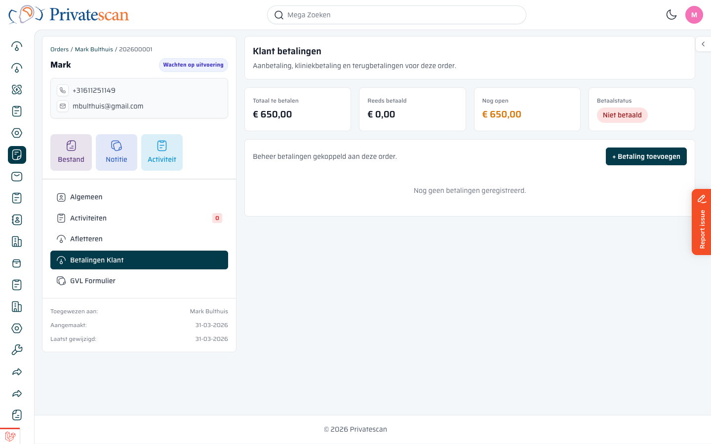

== Order detailpagina

=== Overzicht van de pagina

Open een order door erop te klikken in het kanbanbord, of via de knop *Bekijken* op de bewerkpagina.

De pagina bestaat uit twee delen:

* *Linkerpaneel* — patiëntgegevens, navigatie naar tabbladen
* *Rechterpaneel* — alle inhoud van de order

=== Linkerpaneel

[cols="1,3", options="header"]
|===
| Element | Uitleg

| *Naam + statusbadge*
| De naam van de patiënt en de huidige fase (bijv. _Wachten op uitvoering_).

| *Telefoon / e-mail*
| Contactgegevens van de patiënt.

| *Bestand / Notitie / Activiteit*
| Drie snelknoppen om een bijlage te uploaden, een notitie toe te voegen of een activiteit te registreren.

| *Navigatie*
| Schakel tussen de inhoudstabs: Algemeen, Activiteiten, Afletteren, Betalingen Klant, GVL Formulier.

| *Toegewezen aan / Aangemaakt / Gewijzigd*
| Metadata onderaan het paneel.
|===

=== Rechterpaneel — Algemeen

==== Pipeline-stappen

Bovenin het rechterpaneel zie je de voortgangsbalk met alle fases.
De actieve fase is donker gemarkeerd.

==== AFB-melding

Als de order AFB-dispatch vereist, verschijnt er een *oranje banner* bovenin.
Klik op *AFB nu versturen* om de aanvraagformulieren naar de kliniek te sturen.

==== Order gegevens

[cols="1,3", options="header"]
|===
| Veld | Uitleg

| *Ordernummer*
| Uniek nummer (bijv. 202600001).

| *Titel*
| Naam van de order.

| *Totaalprijs*
| De totale verkoopprijs (exclusief verloren items).

| *Betaling klant*
| Status van de klantbetaling: _Niet betaald_, _Deels betaald_ of _Volledig betaald_.

| *Totale inkoopprijs*
| De inkoopkosten voor de kliniek.

| *Inkoop status*
| Of de inkoop al is ontvangen.

| *Eerste onderzoek*
| Datum en tijd van het eerste geplande onderzoek.

| *Gecombineerde order*
| Of meerdere onderzoeken gecombineerd zijn in deze order.
|===

==== Gekoppelde Sales & Lead

Hier zie je de sales lead en de gewone lead die aan deze order zijn gekoppeld.
Klik op een naam om direct naar de bijbehorende record te gaan.

==== Order Items

Per orderitem zie je:

[cols="1,3", options="header"]
|===
| Kolom | Uitleg

| *Product*
| De naam van het onderzoek of de scan.

| *Persoon*
| De patiënt voor wie dit item geldt.

| *Aantal*
| Hoe vaak dit product is besteld.

| *Prijs*
| De verkoopprijs voor dit item.

| *Status*
| *Nieuw* (nog niet ingepland), *Ingepland* (datum in agenda), *Gewonnen* (uitgevoerd), *Verloren* (geannuleerd).
|===

Verloren items tellen *niet* mee in de totaalprijs.

==== Persoon

Onderaan staat de gekoppelde contactpersoon (patiënt) met naam, telefoonnummer en e-mailadres.

=== Activiteiten tab

Klik op *Activiteiten* in het linkerpaneel om notities, telefoongesprekken en taken te bekijken die zijn gelogd bij deze order.
Hier kun je ook nieuwe activiteiten registreren.

=== Afletteren tab

Dit tabblad toont de financiële afstemming tussen inkoop en invoice per orderitem.

[cols="1,3", options="header"]
|===
| Kolom | Uitleg

| *Inkoop totaal*
| Wat de kliniek in rekening brengt.

| *Invoice totaal*
| Wat al is gefactureerd aan de klant.

| *Verschil*
| Het verschil tussen invoice en inkoop.

| *Status*
| _Niet ontvangen_, _Deels ontvangen_ of _Ontvangen_.
|===

Klik op *▶ Uitsplitsing* bij een item voor de details per deelpost.

=== Betalingen Klant tab

Dit tabblad toont alle betalingen van de klant voor deze order.

[cols="1,3", options="header"]
|===
| Blok | Uitleg

| *Totaal te betalen*
| De volledige verkoopprijs van de order.

| *Reeds betaald*
| Wat al is ontvangen.

| *Nog open*
| Het resterende bedrag.

| *Betaalstatus*
| _Niet betaald_, _Deels betaald_ of _Volledig betaald_.
|===

Klik op *+ Betaling toevoegen* om een nieuwe betaling te registreren.
