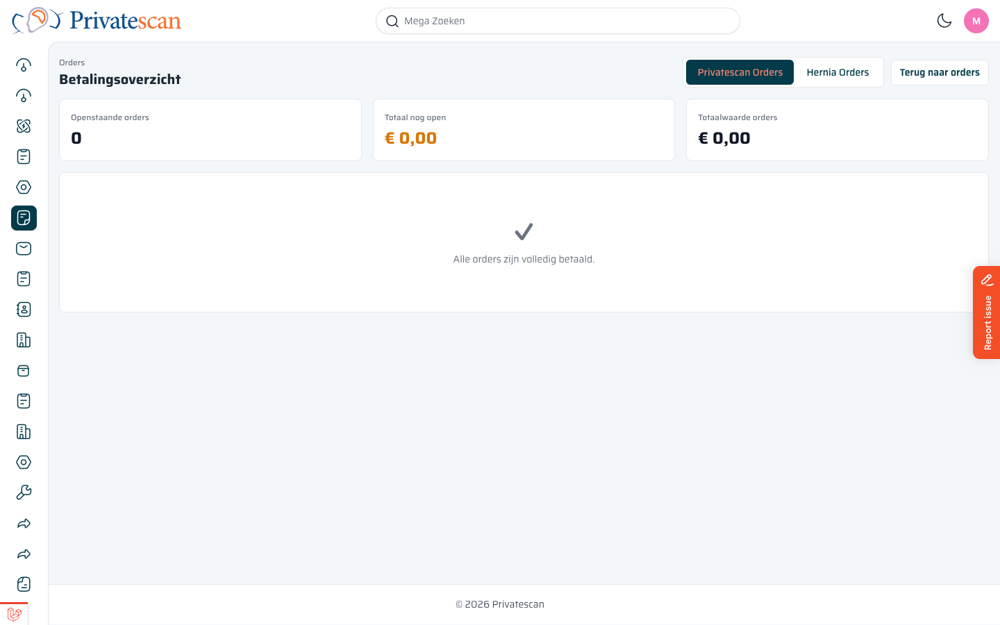

[[betalingsoverzicht]]
== Betalingsoverzicht

Het *Betalingsoverzicht* biedt een snel inzicht in alle orders met openstaande betalingen.

=== Openen

Klik op *$ Betalingsoverzicht* in de bovenbalk van het Orders-kanbanbord.

=== Wat zie je?

[cols="1,3", options="header"]
|===
| Blok | Uitleg

| *Openstaande orders*
| Het aantal orders waarvoor nog betaling ontbreekt.

| *Totaal nog open*
| Het totale openstaande bedrag (oranje weergegeven).

| *Totaalwaarde orders*
| De totale waarde van alle orders in dit overzicht.
|===

=== Tabs

Gebruik de tabs bovenin om te wisselen tussen *Privatescan Orders* en *Hernia Orders*.

Als alle orders volledig zijn betaald, toont het scherm een vinkje met de melding _Alle orders zijn volledig betaald_.

TIP: Gebruik dit scherm dagelijks om te controleren of er openstaande betalingen zijn die opgevolgd moeten worden.
