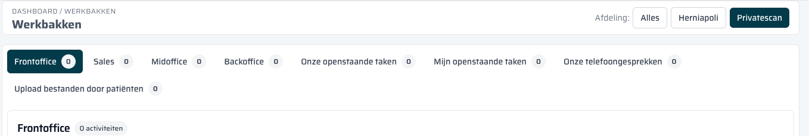

== Wat zijn Werkbakken?

De *Werkbakken* zijn het centrale startpunt van je werkdag in het Privatescan CRM.
Ze tonen precies welke taken er nu op jou of je team liggen te wachten — gegroepeerd per fase in het proces.

=== Waarom werkbakken?

Elke patiëntreis in het CRM doorloopt meerdere stappen: van eerste aanvraag tot afronding en betaling.
Op elke stap kunnen acties of taken open blijven staan.
De werkbakken zorgen dat je die niet hoeft te zoeken:
alles wat aandacht nodig heeft, staat automatisch in de juiste bak.

=== Navigeren naar Werkbakken

Klik op het *eerste pictogram* bovenin het zijbalkmenu (het huis/dashboard-icoon).

image::../images/01-werkbakken-overzicht.png[Werkbakken overzicht]

De pagina heet *Dashboard / Werkbakken* en is zichtbaar als kruimelpad bovenin het scherm.

=== Opbouw van de pagina

[cols="1,3", options="header"]
|===
| Element | Uitleg

| *Afdelingsfilter (rechtsboven)*
| Schakel tussen *Alles*, *Herniapoli* en *Privatescan* om alleen de werkbakken van die afdeling te zien.

| *Werkbak-tabs (bovenin)*
| Elke tab is een werkbak. Het getal in de tab geeft het aantal openstaande items aan.

| *Rood getal*
| Verlopen items — deze hadden al afgehandeld moeten zijn (deadline verstreken).

| *Grijs getal*
| Gewone openstaande items zonder verlopen deadline.

| *Tabel*
| De items in de actieve werkbak, met kolommen Titel, Gerelateerd aan, Type, Toegewezen aan, Aangemaakt op, Deadline en Acties.
|===

=== Tabelkolommen

[cols="1,3", options="header"]
|===
| Kolom | Uitleg

| *Titel*
| De naam van de taak of activiteit. Klik erop om naar het bijbehorende record te gaan.

| *Gerelateerd aan*
| De lead, sales lead of order waaraan deze activiteit is gekoppeld.

| *Type*
| Het soort activiteit: taak, telefoongesprek, bestand of patiëntbericht.

| *Toegewezen aan*
| De medewerker die verantwoordelijk is voor afhandeling.

| *Aangemaakt op*
| Wanneer het item is aangemaakt.

| *Deadline*
| De uiterste datum voor afhandeling. Items met een verlopen deadline worden rood getoond.

| *Acties*
| Knoppen om het item te openen of af te handelen.
|===

NOTE: Alleen items die *nog niet afgehandeld zijn* (`is_done = false`) verschijnen in de werkbakken.
Zodra je een taak als afgerond markeert, verdwijnt hij automatisch uit de lijst.
