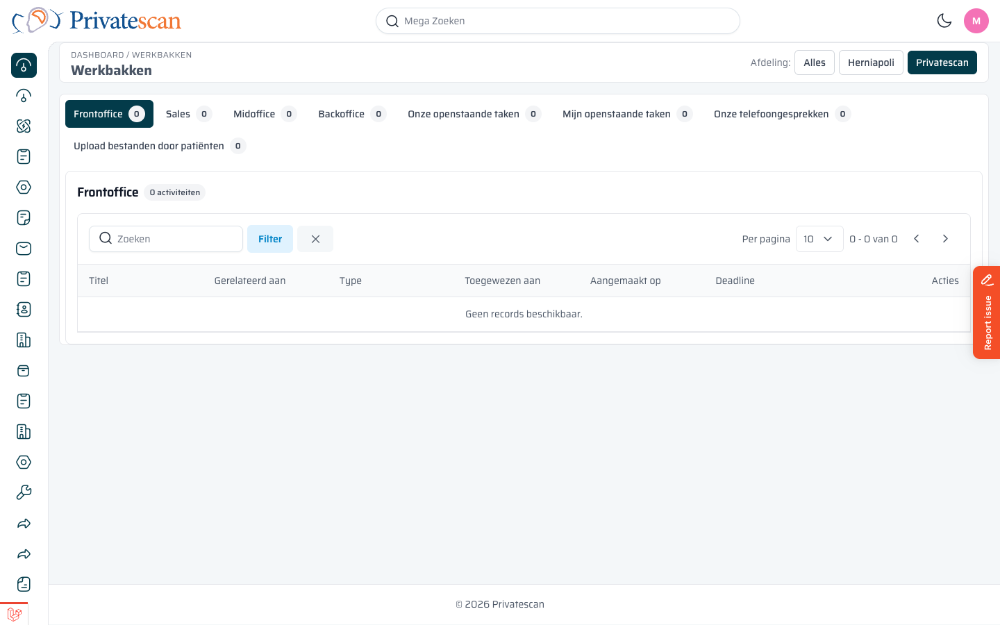
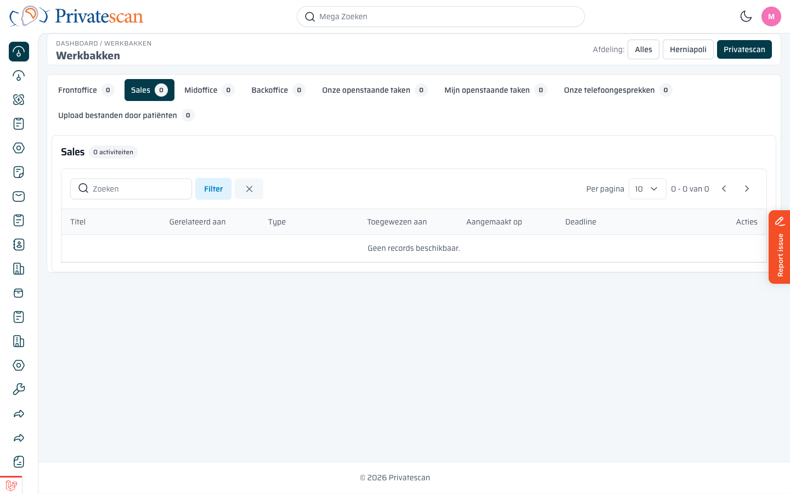
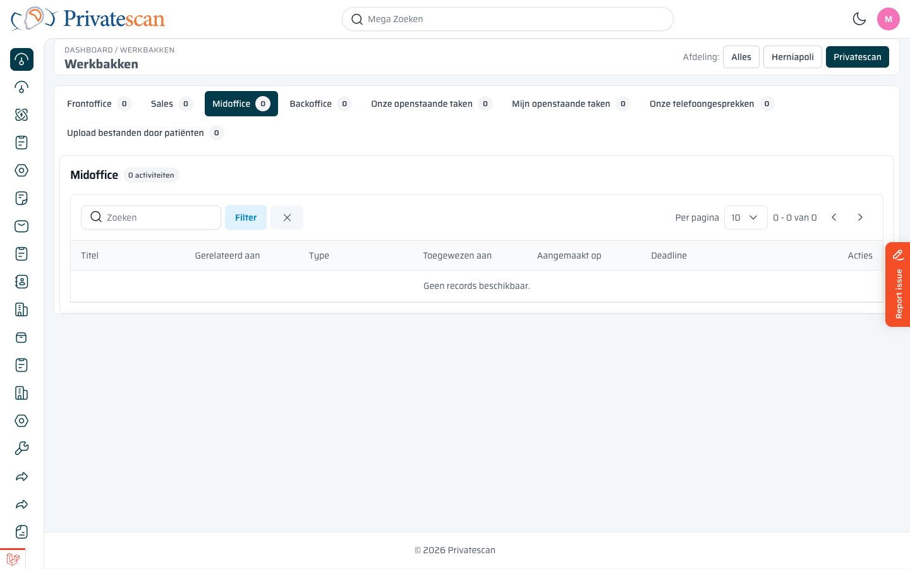
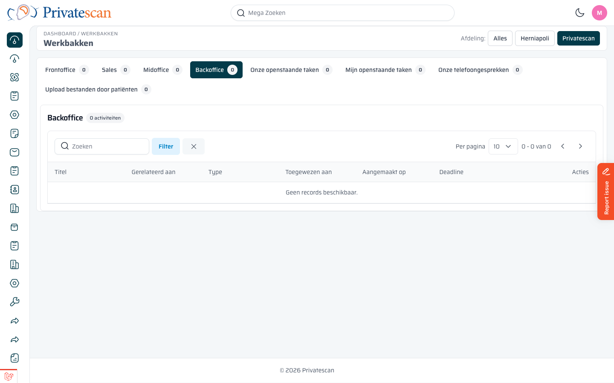
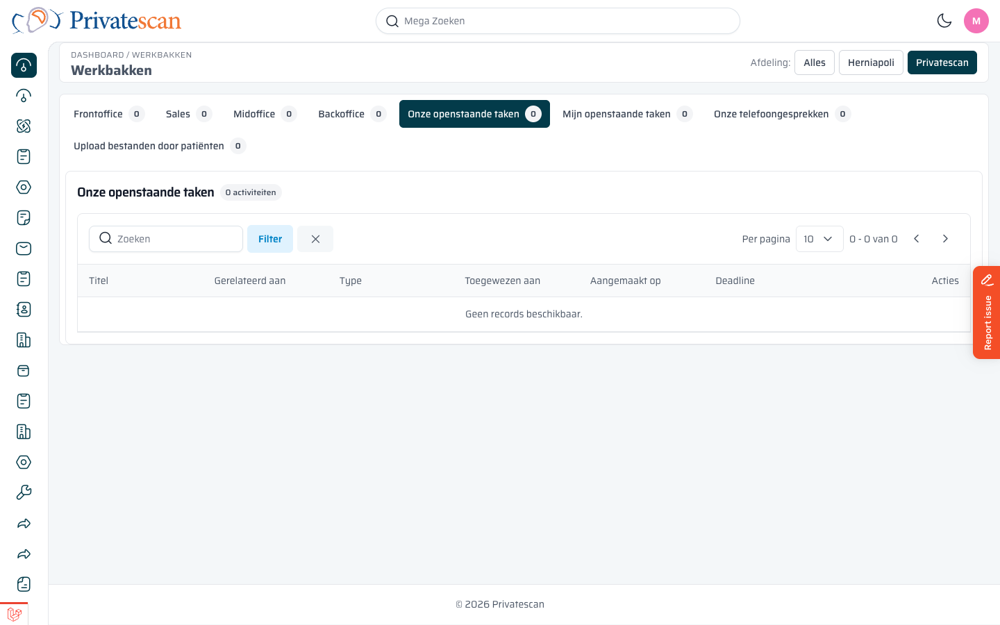
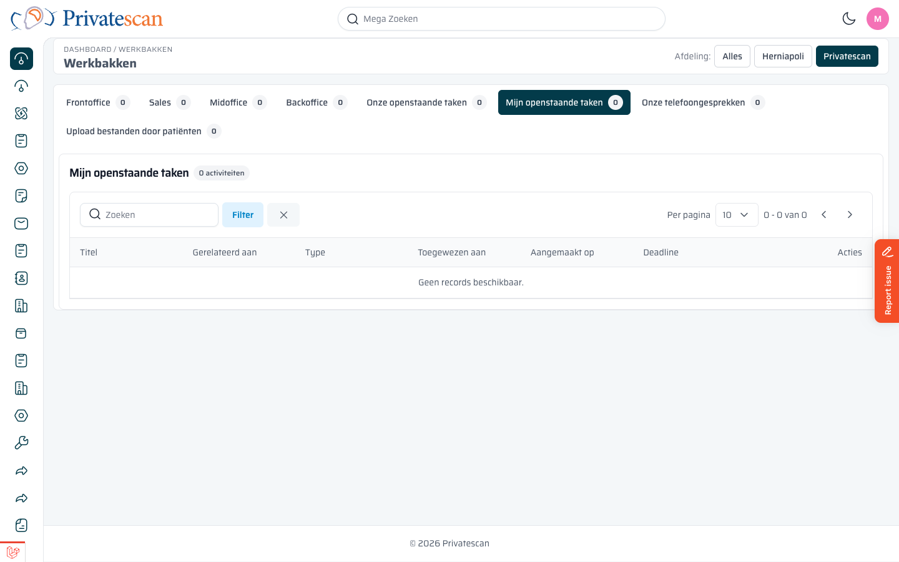
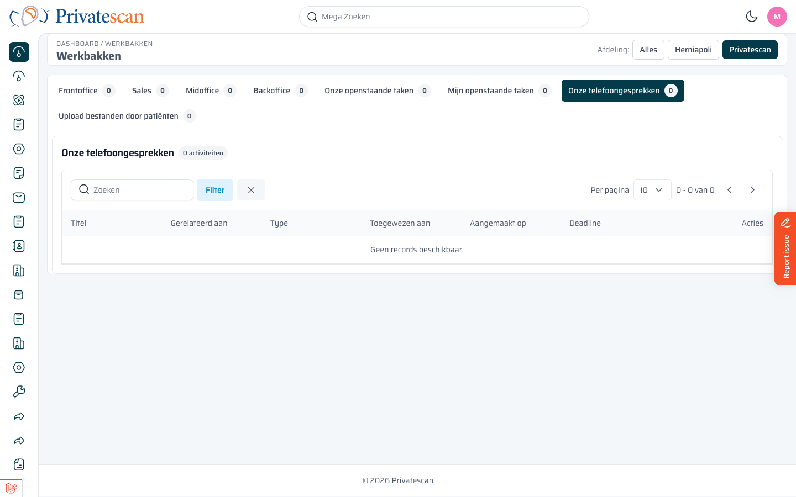
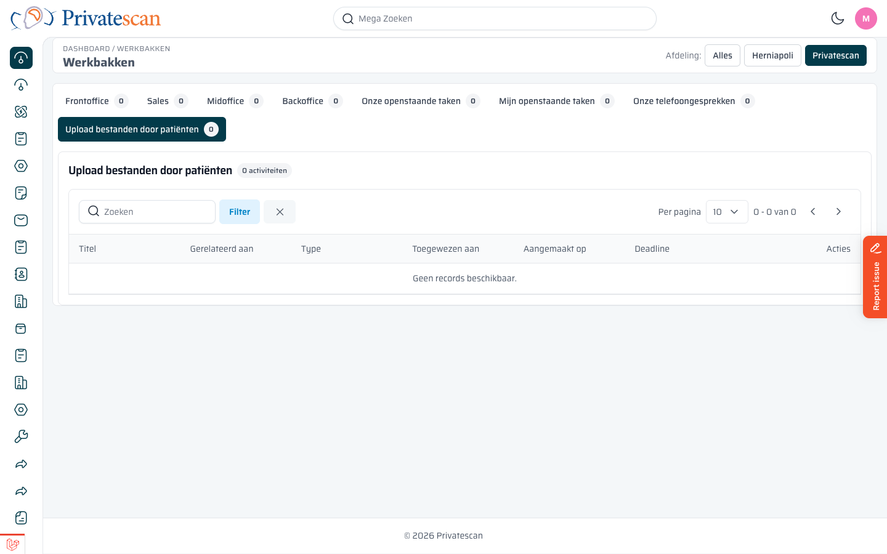

== De werkbakken uitgelegd

Er zijn acht werkbakken. Elke bak toont activiteiten die horen bij een bepaalde fase of een bepaald type taak.
Hieronder staat per werkbak wat erin zit en wanneer je hem gebruikt.

---

=== Frontoffice

*Wat zit erin?*
Activiteiten gekoppeld aan leads die nog in de allereerste fase zitten:
nieuwe aanvragen die binnengekomen zijn via de website, telefoon of e-mail en nog gekwalificeerd moeten worden.

*Wanneer gebruik je dit?*
Dit is de eerste stap. Gebruik deze bak om nieuwe patiëntvragen te beoordelen en te beslissen:

* Is dit een serieuze aanvraag? Zet de lead dan een stap verder.
* Past het niet? Markeer de lead als verloren.

*Sortering:* Nieuwste items bovenaan (meest recent binnengekomen).

---

=== Sales

*Wat zit erin?*
Activiteiten gekoppeld aan leads in de adviesfase: klanten die je al gesproken hebt en die je nu begeleidt richting een beslissing of boeking.

*Wanneer gebruik je dit?*
Gebruik deze bak om lopende verkooptrajecten op te volgen:

* Terugbelafspraken nakomen.
* Offertes bespreken.
* De klant naar een definitieve keuze begeleiden.

*Sortering:* Op basis van urgentie (deadlines en aanmaakdatum).

---

=== Midoffice

*Wat zit erin?*
Activiteiten gekoppeld aan orders die nog vóór de uitvoering zitten:
orders die bevestigd moeten worden, ingepland zijn en wachten op akkoord, of klaar staan voor uitvoering.

*Wanneer gebruik je dit?*
Gebruik deze bak voor de operationele voorbereiding:

* Orderbevestigingen versturen naar de klant.
* Controleren of alle informatie compleet is.
* De planning afstemmen met de kliniek.

*Fasen die hier zichtbaar zijn:*
Order bevestigen → Ingepland wacht op akkoord → Order akkoord → Wachten op uitvoering.

*Sortering:* Op geplande datum oplopend (vroegste uitvoering bovenaan).

---

=== Backoffice

*Wat zit erin?*
Activiteiten gekoppeld aan orders die al zijn uitgevoerd:
onderzoeken die zijn gedaan en waarvan het rapport nog opgesteld of vertaald moet worden.

*Wanneer gebruik je dit?*
Gebruik deze bak na afloop van de scan:

* Controleren of het rapport al ontvangen is.
* Bewaken dat rapporten op tijd worden vertaald.
* De order definitief afronden.

*Fasen die hier zichtbaar zijn:*
Uitgevoerd wachten op operatieverslag → Rapporten ontvangen.

*Sortering:* Op geplande datum oplopend.

---

=== Onze openstaande taken

*Wat zit erin?*
Alle interne *taken* (type: taak) die nog open staan voor het hele team — ongeacht aan wie ze zijn toegewezen.

*Wanneer gebruik je dit?*
Gebruik deze bak als teamoverzicht:

* Controleren of er teamtaken zijn die nog niemand heeft opgepakt.
* Bijspringen als een collega ziek is of verzuimt.

TIP: Dit is een gedeeld overzicht. Iedereen in het team kan taken van een ander overnemen.

*Sortering:* Op deadline oplopend.

---

=== Mijn openstaande taken

*Wat zit erin?*
Alleen de interne *taken* die aan *jou persoonlijk* zijn toegewezen.

*Wanneer gebruik je dit?*
Dit is jouw persoonlijke takenlijst. Begin hier elke ochtend om te zien wat er op jou wacht.

*Sortering:* Op deadline oplopend (dringende taken bovenaan).

---

=== Onze telefoongesprekken

*Wat zit erin?*
Alle activiteiten van het type *telefoongesprek* (calls) voor het team.
Zowel afgehandelde als openstaande gesprekken zijn zichtbaar.

*Wanneer gebruik je dit?*
Gebruik deze bak om:

* Terugbelverzoeken bij te houden.
* Te controleren of geplande gesprekken al zijn gevoerd.
* Verlopen terugbelafspraken snel te signaleren (rood gemarkeerd).

NOTE: In tegenstelling tot de andere bakken toont deze bak ook afgehandelde gesprekken — zo blijft er een volledig gesprekshistorie zichtbaar.

*Sortering:* Op geplande datum oplopend.

---

=== Upload bestanden door patiënten

*Wat zit erin?*
Bestanden die *patiënten zelf* hebben geüpload via het patiëntenportaal — en die nog niet zijn bekeken of verwerkt.

*Wanneer gebruik je dit?*
Controleer deze bak regelmatig om:

* Ingezonden formulieren of documenten te verwerken.
* Patiëntbestanden door te sturen naar de juiste afdeling.
* Ontvangst te bevestigen als de patiënt dat verwacht.

*Sortering:* Nieuwste uploads bovenaan.
