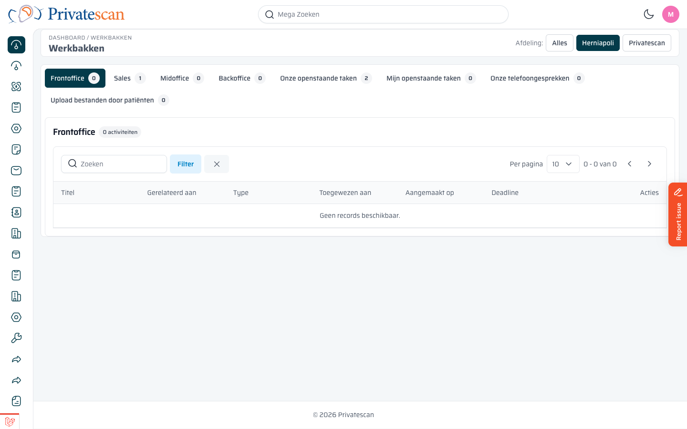
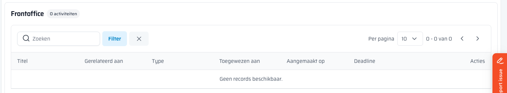

== Werkwijze

=== Dagelijkse routine

Een goede routine zorgt dat niets vergeten wordt.
Doorloop de werkbakken elke dag in deze volgorde:

. *Mijn openstaande taken* — begin met jouw eigen takelijst
. *Frontoffice* — verwerk nieuwe aanvragen
. *Sales* — volg lopende verkooptrajecten op
. *Midoffice* — controleer orders voor uitvoering
. *Backoffice* — bewaken van rapporten na uitvoering
. *Onze telefoongesprekken* — terugbelverzoeken nakomen
. *Upload bestanden* — patiëntdocumenten verwerken

=== Afdelingsfilter gebruiken

Rechtsboven staan de knoppen *Alles*, *Herniapoli* en *Privatescan*.

* Kies *Privatescan* om alleen de activiteiten van de Privatescan-afdeling te zien.
* Kies *Herniapoli* om alleen de Herniapoli-activiteiten te zien.
* Kies *Alles* voor een gecombineerd overzicht.

De afdeling die je het meest gebruikt, wordt standaard geselecteerd.
Bij je eerste bezoek op de dag is automatisch jouw eigen afdeling actief.

=== Zoeken en filteren

Boven de tabel vind je een *zoekveld* en een *Filterknop*.

* Typ in het zoekveld om direct te zoeken op naam of titelinhoud.
* Klik *Filter* om extra filteropties te openen, zoals filteren op toegewezen medewerker of type.
* Klik het *×* naast Filter om alle filters te wissen.

Rechts zie je hoeveel items er zijn en kun je bladeren door de pagina's via de pijlknoppen.

=== Item openen

Klik op de *Titel* van een item in de tabel om direct naar de bijbehorende lead of order te gaan.
Zo ga je met één klik van de werkbak naar de juiste plek om actie te ondernemen.

=== Item afhandelen

Nadat je actie hebt ondernomen op een item (taak afgerond, gesprek gevoerd, bestand verwerkt):

. Open de lead of order via de tabel.
. Markeer de activiteit als *afgerond* (vinkje zetten bij de activiteit).

Het item verdwijnt dan automatisch uit de werkbak.

WARNING: Vergeet niet de activiteit als afgerond te markeren. Zolang dit niet gedaan is, blijft het item in de werkbak staan en telt het mee als openstaande taak voor het hele team.

=== Deadlines en verlopen items

Items met een verstreken deadline worden *rood weergegeven* in de tabel.
Ze tellen ook mee in het rode getal op de tab.

Behandel verlopen items als prioriteit. Een verlopen item betekent dat de klant al langer wacht dan afgesproken.

=== Taakoverdracht (takeover)

Als een collega een activiteit in behandeling heeft maar je moet het overnemen:

. Klik op het item in de werkbak.
. Kies *Overnemen* in het venster dat verschijnt.

Je moet bevestigen dat je de taak overneemt. Na bevestiging is de activiteit aan jou toegewezen.

NOTE: Voor overnemen heb je de juiste rechten nodig (_activities.takeover_). Heb je dit niet, neem dan contact op met je beheerder.
