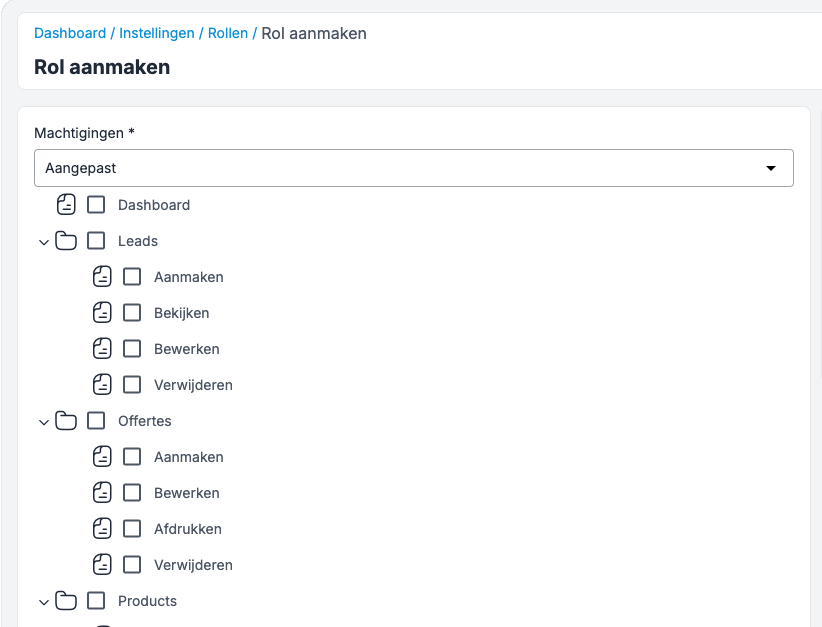

=== Database Structuur

include::db_structure.adoc[]

=== Pipeline stages per entiteit (status)

Requirements:

* Vanuit de entiteit zul je niet zomaar altijd de status kunnen aanpassen (soms mag dit alleen vanuit de workflow)
* Er kunnen verplichte velden zijn tussen de status overgangen

[plantuml]
....
@startuml
left to right direction
skinparam state {
  BackgroundColor #FDF6E3
  BorderColor Black
  FontSize 11
}

' -- LEAD (hernia & privatescan --
state "Lead" as Lead {
  [*] --> lead_new : "nieuw"
  state lead_new as "no-pipeline (Technische status, zou altijd een lege lijst moeten zijn)"
  state lead_progress as "Klant adviseren"
  state lead_progress_after as "Klant adviseren opvolgen"
  state lead_win as "win"
  state lead_lose as "lose"

  lead_new --> lead_progress
  lead_new --> lead_lose
  lead_progress --> lead_progress_after
  lead_progress --> lead_lose
  lead_progress_after --> lead_win
  lead_progress_after --> lead_lose
}

' -- ORDER --
state "Order" as Order {
  [*] --> order_new : "nieuw"
  state order_new as "nieuw"
  state order_send as "verzonden"
  state order_confirmed as "akkoord"
  state order_cancelled as "niet akkoord"
  state order_payed as "betaald"
  state order_not_payed as "niet betaald"
  state order_afgerond as "afgerond"

  order_new --> order_send
  order_send --> order_confirmed
  order_send --> order_cancelled
  order_confirmed --> order_payed
  order_confirmed --> order_not_payed
  order_payed --> order_afgerond
}

' -- WORKFLOW --
state "Backoffice" as Backoffice {
  [*] --> wf_new : "Lead gewonnen"
  state wf_new as "Bestelling voorbereiden"
  state wf_order_send as "Order verstuurd, wachten op akkoord patiënt"
  state wf_order_confirmed_patient_wait_payment as "Order Akkoord, wachten op betaling"
  state wf_order_confirmed_patient_and_payed as "order bevestigd, wachten op akkoord kliniek"
  state wf_closed as "afgerond"

  wf_new --> wf_order_send
  wf_new --> wf_closed
  wf_order_send --> wf_order_confirmed_patient_wait_payment
  wf_order_send --> wf_closed
  wf_order_confirmed_patient_wait_payment --> wf_order_confirmed_patient_and_payed
  wf_order_confirmed_patient_wait_payment --> wf_closed
  wf_order_confirmed_patient_and_payed --> wf_closed

}

' -- ACTIE --
state "Actie" as Actie {
  [*] --> actie_pending : "in afwachting"
  actie_pending --> actie_progress : "bezig"
  actie_progress --> actie_finished : "afgerond"
}
note right of Actie
    Model Activity met eigen type hiervoor gebruiken?
end note
note right of Lead
    Technisch een los bord voor Hernia en Privatescan, maar nu dezelfde statussen.
end note
@enduml
....

==== Toelichting op het CRM-datamodel en de lifecycle van entiteiten

Het bovenstaande datamodel beschrijft de kernentiteiten binnen de CRM-omgeving en hun onderlinge relaties. Deze toelichting licht toe hoe de entiteiten zich gedragen binnen de klantreis (customer journey) en hoe workflows automatisch reageren op veranderingen.

=== Lead lifecycle

De lead vormt het startpunt van de klantreis. Zodra een nieuwe lead wordt aangemaakt:

* krijgt deze automatisch de pipeline stage `"no-pipeline"` toegewezen
* Afdeling wordt bepaald op basis van de lead type ('Operatie' wordt nu Hernia en de rest Privatescan).
* Op basis van Afdeling wordt er een nieuwe pipeline stage bepaald (zie LeadObserver), daarmee komt de lead op het bord van Hernia of Privatescan te staan.
* en wordt er een eerste actie toegevoegd aan deze workflow, klant data bijwerken.

Gedurende de lifecycle kan de lead door meerdere pipeline stages bewegen, bijvoorbeeld `"Nieuwe aanvraag kwalificeren"`, `"Klant adviseren"`, `"Klant adviseren opvolgen"`, `"won"` of `"lost"`. Bij elke overgang kan er automatisch een nieuwe actie of notificatie gegenereerd worden.
Lead left in front office process / sales. Na bestellen, zal het een gewonnen lead zijn en zijn lifeclycle eindigen.
Lead kan in dit gehele proces verloren gaan, bijvoorbeeld als er geen reactie komt van de klant of als de lead niet meer relevant is.

Bij een won eindigd de lead lifecycle en  start de backoffice workflow

=== Backoffice lifecycle

Elke lead kan resulteren in maximaal één backoffice workflow. Daarmee start de medewerker met het opstellen van een order en het versturen van de order bevestiging.

Deze workflow eindigd, zodra er geen actief meer liggen voor de patient. Bij Hernia zal deze nog wat langer duren met nazorg dan bij Hernia.

Ook hier heeft elke afdeling hun eigen bord met hun eigen statussen. (net als bij Leads)

=== Workflow en acties

De workflow is gekoppeld aan een specifieke pipeline stage. Zodra een entiteit (zoals een lead of order) van status verandert, kunnen er events gegenereerd worden waarop een workflow reageert.

Workflows kunnen automatisch acties aanmaken, zoals:
- het toewijzen van een taak aan een gebruiker,
- het verzenden van een e-mail,
- of het starten van een vervolgproces.

[NOTE]
====
Krayin kent een eigen workflow model, waarmee je condities en acties kunt koppelen. Vergelijkbaar met SugarCRM. We gebruiken dit minimaal. b.v. afdeling wordt gepaald in deze workflow. Denk hierbij aan een veld x krijgt een waarde op basis van andere velden van dezelfde entiteite of een andere entiteit. Overige beleggen we in N8N.
Verwar deze workflow niet met onze Workflow entiteit.
====

Elke workflow kent zijn eigen type. Dit is een voor geprogrammeerde work flow met specifieke acties. Zo zullen we er een maken voor Privatescan en een opzetten voor Hernia. Dit maakt het mogelijk om workflows te personaliseren op basis van de afdeling of het type lead.

Elke actie is gekoppeld aan een pipeline stage én een workflow, en wordt gebruikt om opvolging binnen het CRM te structureren en automatiseren.

==== Samenvattend

De combinatie van leads, pipeline stages, backoffice en acties vormt de basis van het CRM-proces. Door dit op entiteitenniveau vast te leggen én dynamisch te laten reageren op statusveranderingen, ontstaat een flexibel en schaalbaar systeem voor klantopvolging en interne procesautomatisering.

=== Email en Notificaties

Alle communicatie met patiënten zal voortaan uitsluitend via het CRM verlopen. Hierdoor ontstaat een volledig en doorzoekbaar overzicht per patiënt, en kunnen we beter voldoen aan onze kwaliteits- en privacyrichtlijnen.

Medewerkers dienen *geen e-mails met patiënten meer te versturen via Outlook*. E-mails die buiten het CRM worden verstuurd, zijn niet zichtbaar in het systeem en kunnen daardoor niet worden meegenomen in het dossier of in workflow-automatisering. Dit kan technisch niet worden afgedwongen, maar het is van belang dat medewerkers dit actief naleven.

==== E-mail koppeling aan activiteiten

Activiteiten kunnen nu direct gekoppeld worden aan e-mails, vergelijkbaar met hoe e-mails gekoppeld zijn aan leads. Dit biedt de volgende functionaliteiten:

* *E-mail kolom in activiteiten overzicht*: Alle activiteitstypen tonen een kolom "Gekoppelde E-Mail" waarin wordt aangegeven of er een e-mail gekoppeld is aan de activiteit
* *E-mail link in activiteiten tijdlijn*: In de lead view wordt bij activiteiten met een gekoppelde e-mail een link getoond om de e-mail te bekijken
* *Automatische e-mail dialoog bij belstatus*: Bij het toevoegen van een belstatus kan een checkbox "E-Mail versturen?" worden aangevinkt, waarna automatisch een e-mail dialoog wordt geopend met het standaard e-mailadres van de lead of gekoppelde persoon
* *E-mail prioritering*: Het systeem zoekt eerst naar e-mailadressen van gekoppelde personen, en valt terug op het e-mailadres van de lead zelf indien geen persoon gekoppeld is

==== Randvoorwaarden voor e-mail via het CRM

Om e-mail via het CRM een volwaardig alternatief te maken voor Outlook, worden de volgende eisen gesteld:

* *Gebruiksvriendelijkheid*
** Overzichtelijke interface (bijv. inbox/outbox per lead/contactpersoon)
** Ondersteuning voor standaard opmaakopties (vet, cursief, lijsten, etc.)
** Makkelijk zoeken en terugvinden van eerdere communicatie
** Snel kunnen schakelen tussen standaard templates en vrije tekst

* *Leverbetrouwbaarheid*
** E-mails dienen goed afgeleverd te worden en zo min mogelijk in de spam terecht te komen
** Hiervoor wordt gebruik gemaakt van een betrouwbare e-mailprovider (bijv. Postmark, SMTP met DKIM/SPF)
** Monitoring van bounce rates en optioneel waarschuwingen bij afleverproblemen

* *Taal en huisstijl*
** E-mails worden automatisch opgesteld in de taal van de patiënt (NL, EN, etc.)
** Elke e-mail wordt verstuurd in de juiste huisstijl (bijv. PrivateScan of Hernia) inclusief e-mailhandtekening

* *Bijlagen*
** Ondersteuning voor het toevoegen van documenten (PDF, GVL, kaarten, etc.)
** Bijlagen worden schaalbaar en veilig opgeslagen, bijv. in een MinIO bucket

* *Herbruikbaarheid*
** Een verzonden e-mail moet opnieuw verstuurd kunnen worden naar een aangepast adres (bijv. bij fout e-mailadres patiënt)

==== Hybride communicatie: met klinieken en artsen

Voor communicatie met klinieken of externe zorgverleners hanteren we een hybride aanpak:

* *Voorkeur*: via het CRM
* *Uitzondering*: ad-hoc of informele communicatie, die via Outlook verloopt

In deze gevallen kan alsnog een *CC naar een speciaal CRM-adres* worden gestuurd. Het systeem herkent deze mail en maakt hier automatisch een actie van in de tijdlijn. Deze actie toont de inhoud van de mail en kan handmatig worden verwerkt of afgesloten.

==== Privacy & beveiliging

Vanuit de AVG hanteren we het uitgangspunt dat *er geen medische gegevens in e-mails worden opgenomen*. In plaats daarvan worden medische documenten of inhoud uitsluitend ter inzage aangeboden via een beveiligde link naar het patiëntenportaal.

Voordelen van deze aanpak:

* De inhoud van de e-mail blijft AVG-proof en laag-risico
* Het portaal is afgeschermd en vereist inloggen door de patiënt
* We behouden flexibiliteit in e-mailverkeer en kunnen eenvoudiger afleverbaarheid (deliverability) garanderen

Richtlijnen:

* Vermeld in de e-mail alleen een korte toelichting en verwijs naar de beveiligde link
* Stuur geen PDF’s, rapportages of andere medische bijlagen direct mee in de e-mail. (Algemene, publieke informatie is prima. Zolang het maar geen verwijzing staat naar een natuurlijke persoon.)
* De link verwijst naar een afgeschermde omgeving binnen het patiëntenportaal
* De patiënt moet inloggen om toegang te krijgen tot de inhoud
* Log alle interactie met het portaal, inclusief wanneer documenten zijn geopend of ondertekend

=== Rollen & rechten
Gebruikers worden gekoppeld aan rollen. Elke rol bepaalt welke acties (CRUD) toegestaan zijn op specifieke entiteiten zoals leads, producten of activiteiten. De rechtenstructuur sluit aan op de beschikbare routes in het systeem (zoals /leads, /products, etc.).

Per rol kun je instellen of iemand:

* mag bekijken (read),
* mag aanmaken (create),
* mag wijzigen (update),
* of mag verwijderen (delete).

Deze rechten worden centraal beheerd via het ACL-systeem (Access Control List) in de admin-interface.
Hierdoor houd je controle over wat elke gebruiker wél of niet mag doen binnen het CRM.

==== User groups

De standaard rolverdeling in Krayin is niet altijd voldoende voor fijnmazige toegangscontrole. Zo willen we bijvoorbeeld instellen dat medewerkers van de afdeling Hernia geen toegang hebben tot gegevens van Privatescan, en andersom. Tegelijkertijd zijn er ook gebruikers die juist toegang moeten hebben tot beide afdelingen.

Om dit mogelijk te maken, hebben we een groepsstructuur geïntroduceerd. Gebruikers worden toegewezen aan een groep, zoals Hernia of Privatescan. Op SQL-niveau filteren we vervolgens welke gegevens per groep zichtbaar zijn.

Deze afscherming geldt bijvoorbeeld voor entiteiten als:

* Leads
* Backoffice-taken
* Activities

Op deze manier combineren we rolgebaseerde toegang (rechten op functies) met groepsgebaseerde toegang (rechten op data).

==== Voorbeeld: Flow van een ordermail

Zodra een lead de status **"order opzetten"** bereikt, zal er automatisch een actie gegenereerd worden in het CRM om een ordermail te versturen.

De CRM genereert dan een e-mail met de volgende inhoud:

- *Link naar het GVL-formulier*, uniek per patiënt
- *Bijlage(n)*: relevante kaarten of documentatie
- *Tekst*: gegenereerd vanuit een template en vertaald naar de taal van de patiënt
- *Onderwerpregel* bevat altijd de `Lead ID` → dit zorgt voor traceerbaarheid
- *Inhoud bevat*: een beveiligde link om de order digitaal te ondertekenen

Na succesvolle digitale ondertekening door de patiënt:

- Wordt automatisch een actie gestart in de backoffice-workflow
- De order komt in een volgende verwerkingsstatus terecht (bijv. "Bevestigd")

=== Aanmeldingen voor families en bedrijven

Naast losse personen dient men zich ook te kunnen aanmelden als *familie* of *bedrijf*.
In dat geval gelden er enkele aanvullende afspraken en vereisten:

==== Behandeling per persoon

Ook bij een gezamenlijke aanmelding worden de betrokken personen *individueel verwerkt* in het CRM:

- Elke persoon ontvangt een *eigen ordermail* met GVL-formulier.
- Elke persoon moet *individueel akkoord geven* op zijn/haar behandeling.
- Een persoon ziet **alleen zijn/haar eigen orderinformatie**, niet die van andere familieleden of collega’s.

==== Opslag als organisatie

In zowel familie- als bedrijfsaanmeldingen wordt de groep geregistreerd als een `organization` in het CRM.

- De *lead* wordt gekoppeld aan een `contactpersoon` of `organisatie`.
- Dit stelt ons in staat om:
* Gezamenlijke gegevens (zoals adres, telefoon, e-mailadres) vast te leggen
* Één centrale factuur te sturen aan de organisatie

==== Procesverloop

Het reguliere behandelproces blijft voor alle personen ongewijzigd:

- Elke persoon doorloopt de *standaard CRM-flow*.
- In het CRM zijn deze personen zichtbaar onder de tijdlijn van de *contactpersoon* van de organisatie.

==== Afwijking bij facturatie

Het enige verschil in het proces bevindt zich bij de facturatie:

- De factuur wordt niet naar de individuele persoon gestuurd
- In plaats daarvan wordt de factuur gestuurd naar de *organisatiegegevens* of *centrale contactpersoon*

Dit maakt het mogelijk om *één gezamenlijke factuur* te versturen, terwijl de behandelingen apart geregistreerd blijven.

=== Algemeen zoeken

Algemeen zoeken biedt snelle zoekfunctionaliteit over meerdere entiteiten via één invoerveld met tabbladen voor Leads, Sales en Personen.

==== Tabs en velden

===== Leads
De zoekopdracht wordt als OR-combinatie uitgevoerd over:
- first_name, last_name, married_name (via token `name:` → genormaliseerd naar deze velden, met `:like`)
- emails (via token `email:` → genormaliseerd naar JSON column search)
- phones (via token `phone:` → genormaliseerd naar JSON column search)

Let op:
- Resultaten worden gefilterd op toegestane gebruikers (autorisatie).
- Bij zoeken op telefoonnummer wordt automatisch herkend en gezocht op digits-only versie voor betere matching.

===== Sales
De zoekopdracht wordt alleen uitgevoerd op:
- name (met `:like`)

Let op:
- Sales ondersteunt geen zoeken op email of telefoonnummer, alleen op naam.

===== Personen
Zoekt OR-combinaties over:
- first_name, last_name, married_name (via `name:` → genormaliseerd)
- organization.name
- emails (via token `email:` → genormaliseerd naar JSON column search)
- phones (via token `phone:` → genormaliseerd naar JSON column search)

Let op:
- Bij zoeken op telefoonnummer wordt automatisch herkend en gezocht op digits-only versie voor betere matching.

==== Doorklikken naar Leads (Kanban)
Bij “Bekijk alle leads die overeenkomen met …” worden `search`, `searchFields` en `searchJoin` in de URL meegenomen en opent het Kanban-bord met hetzelfde filter. Let op:
- Het Kanban-bord toont leads in de huidige pipeline. Als een lead in een andere pipeline staat, wissel dan naar de juiste pipeline om alle resultaten te zien.
- Bij deep-linking via Algemeen zoeken wordt “gewonnen/verloren” standaard getoond (geen filtering op status), zodat resultaten overeenkomen met de Algemeen zoeken.

==== Veelvoorkomende oorzaken zonder resultaten
- De ingelogde gebruiker heeft geen autorisatie voor de verkoper (user_id) van de lead.
- De lead bevindt zich in een andere pipeline dan de huidige Kanban-weergave.
